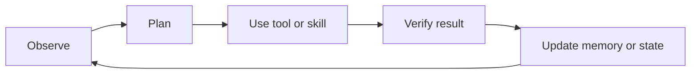

# Agents and agentic skills

## The opening puzzle

When does a model-driven workflow become an agent?

A useful distinction is that a workflow follows a mostly predetermined path, while an agent selects actions dynamically based on state, goals, tools, and feedback.

## The agent loop

## A practical vocabulary

* Model skill: a capability learned or encoded in a model
* Tool: an external capability such as search, code execution, or database access
* Workflow: a predefined sequence of steps
* Agent: a system that chooses actions during execution
* Skill: a reusable capability with instructions, inputs, outputs, and constraints
* Agentic skill: a skill that can observe context, plan, act, verify, and recover

## Why skills matter

Skills turn one-off prompts into reusable units. A robust skill should specify:

* Purpose and scope
* Required inputs
* Available tools
* Expected outputs
* Safety constraints
* Verification steps
* Failure and retry behavior
* Version and owner

## Engineering trade-offs

More autonomy can reduce human effort, but it also increases the number of places where the system can make an irreversible mistake. The right design is often not maximum autonomy; it is appropriate autonomy with clear boundaries.

## Thought experiment

If an agent can create and invoke new skills, who decides which skills are trusted? What evidence should be required before a skill can act without approval?

## Evaluation dimensions

* Task success
* Evidence quality
* Tool-use accuracy
* Recovery from failure
* Cost and latency
* Permission compliance
* Explainability and auditability

## Related concepts

* [RAG](../knowledge/rag)
* [Reinforcement learning](../learning/reinforcement-learning)
* [Autonomous networks](../autonomy/autonomous-networks)
