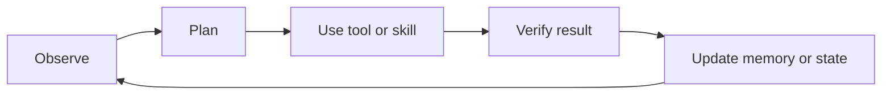
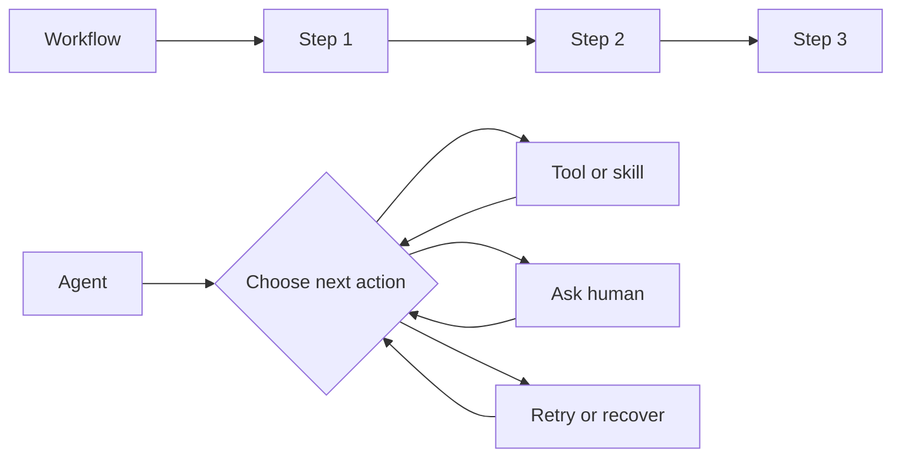
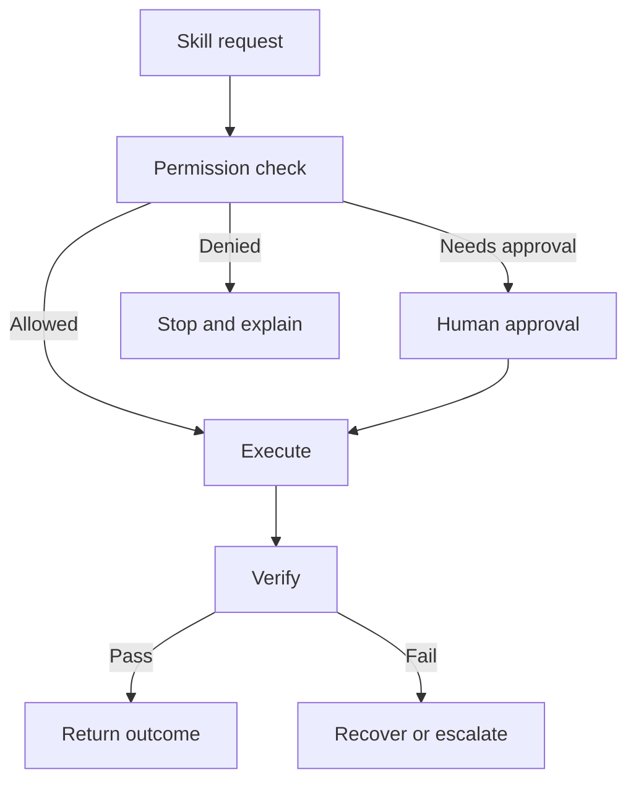

# Agents and agentic skills

## The opening puzzle

When does a model-driven workflow become an agent?

A useful distinction is that a workflow follows a mostly predetermined path, while an agent selects actions dynamically based on state, goals, tools, and feedback. The boundary is not absolute; it is a design spectrum.

## The agent loop

## A practical vocabulary

* Model skill: a capability learned or encoded in a model
* Tool: an external capability such as search, code execution, or database access
* Workflow: a predefined sequence of steps
* Agent: a system that chooses actions during execution
* Skill: a reusable capability with instructions, inputs, outputs, and constraints
* Agentic skill: a skill that can observe context, plan, act, verify, and recover

## Workflow versus agent

A workflow is often easier to test and govern. An agent can handle more variation but introduces more uncertainty about the path taken.

## What makes a skill reusable?

A robust skill should specify:

* Purpose and scope
* Required inputs
* Available tools
* Expected outputs
* Safety constraints
* Verification steps
* Failure and retry behavior
* Version and owner
* Permission boundary
* Evaluation cases

A skill should be treated more like a small governed capability than like a clever prompt.

## What makes a skill agentic?

An agentic skill usually has the ability to:

1. Inspect its current context
2. Determine whether it has enough information
3. Plan one or more actions
4. Use tools within a permission boundary
5. Verify the outcome
6. Recover, escalate, or stop when verification fails

Agentic does not mean unrestricted. The best agentic skills are explicit about what they cannot do.

## Memory and state

Memory may include conversation history, task state, retrieved knowledge, user preferences, learned summaries, or external records. Each kind of memory has different retention, privacy, freshness, and deletion requirements.

## Tool-use risks

* The model selects the wrong tool.
* The tool receives unsafe or incomplete arguments.
* A tool result contains malicious instructions.
* The agent repeats an action after a partial failure.
* A permission boundary is too broad.
* Verification checks only formatting instead of outcome.

## Evaluation dimensions

* Task success
* Evidence quality
* Tool-use accuracy
* Recovery from failure
* Cost and latency
* Permission compliance
* Explainability and auditability
* Human escalation quality

## Governance pattern

## Thought experiments

* If an agent can create and invoke new skills, who decides which skills are trusted?
* What evidence should be required before a skill can act without approval?
* Is a system more autonomous when it can act without humans, or when it can recognize when it should not act?

## Practical exercise

Design a skill for a low-risk task. Write its purpose, inputs, tools, outputs, constraints, verification, and failure behavior. Then remove every permission that is not essential.
