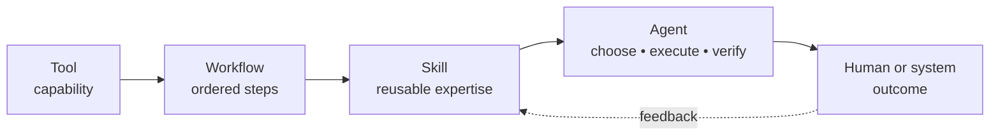
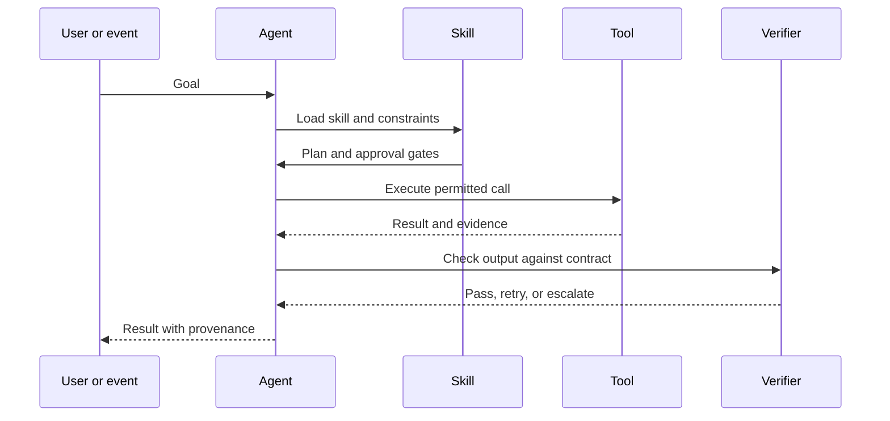

# Agentic skills: packaging reusable expertise

> A tool gives an agent a capability. A skill gives it a repeatable way to use that capability.

A skill is best treated as a governed package of expertise: instructions, prerequisites, inputs, outputs, examples, and checks. Public skill-format guidance describes a lightweight folder-based approach centered on a `SKILL.md` file ([Agent Skills](https://agentskills.io/home)). The format is useful, but the deeper design question is ownership: who maintains the skill, who can invoke it, and how do we know it still works?

## Tool, workflow, skill, agent

| Concept | Primary question | Example |
|---|---|---|
| Tool | What can the system call? | Search an inventory API |
| Workflow | What steps should run? | Retrieve → compare → summarize |
| Skill | How should this task be performed reliably? | Diagnose a failed service with approved checks |
| Agent | Which action should happen next? | Select a skill, call tools, verify, escalate |

## A useful skill contract

A production-ready skill should make these fields explicit:

- **Purpose:** the outcome it is designed to achieve
- **Inputs:** required data, permissions, and assumptions
- **Procedure:** the steps and decision points
- **Tools:** allowed calls and their limits
- **Output:** the expected structure and evidence
- **Verification:** how the result is checked
- **Escalation:** when the skill must stop or ask for approval
- **Owner and version:** who maintains it and what changed

## Agentic does not mean unrestricted

The more autonomy a skill has, the more important its boundary becomes. A useful design pattern is to separate **read**, **recommend**, and **act** permissions. High-impact actions should require explicit policy checks or human approval rather than relying on the model to remember a warning.

Interoperability protocols can make tools and agents easier to connect, but a protocol does not by itself make an action safe. Protocols describe communication; governance describes permission, accountability, and acceptable outcomes. See [Google’s overview of agent protocols](https://developers.googleblog.com/developers-guide-to-ai-agent-protocols/) and [IBM’s deployment perspective](https://www.ibm.com/think/ai-agents).

## Thought experiment

If two agents can both invoke the same tool but have different skills, where does the system’s “policy” actually live: in the model, the skill, the tool, or the approval layer?
