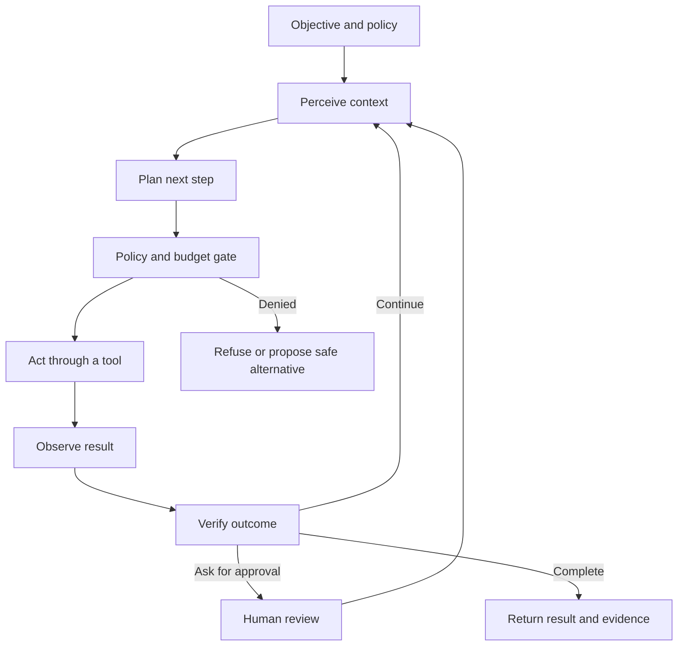

# The agent loop: perceive, plan, act and verify

An agent is best understood as a control loop. It receives an objective and context, forms a next-step proposal, takes an action through a bounded interface, observes the result, updates state and decides whether to continue.

## State is more than conversation history

A useful state model separates:

- **Objective:** what the system is trying to achieve.
- **Constraints:** what it must not do.
- **Working context:** information needed for the current step.
- **Evidence:** observations that support or contradict a hypothesis.
- **Plan:** proposed next actions, not unquestionable truth.
- **Execution record:** tool calls, results, approvals, retries and errors.
- **Memory:** information allowed to persist beyond the current run.

Combining all of these into one prompt makes it difficult to enforce policy and diagnose errors. Keep authoritative state in typed structures where possible, and treat model-generated text as a proposal until validated.

## Planning is not verification

A plan can be coherent and still be wrong. Verification must test the result against an independent criterion. Examples include:

- A schema validator checks whether a generated object is complete.
- A compiler checks whether generated code parses.
- A query result is checked for authorization and expected columns.
- A network action is checked against a change window and postcondition.
- A human confirms an irreversible action.

The verifier should not merely ask the same model whether it did a good job. Independent checks reduce correlated failure, even when they cannot eliminate it.

## Stop conditions

Every loop needs explicit limits:

- Maximum steps
- Maximum elapsed time
- Maximum token or cost budget
- Maximum retries per tool
- Maximum number of delegated tasks
- Approval requirements for high-impact actions
- A terminal error state with a useful explanation

A loop without a stop condition is not autonomy; it is an availability and cost risk.

## Tool contract design

A tool should expose a narrow, typed operation rather than a general-purpose shell. Its description should state:

- Required inputs and allowed ranges
- Expected output schema
- Side effects
- Required permissions
- Idempotency behavior
- Timeouts and retry safety
- Failure codes
- Audit fields

The model should never be the sole enforcement point. Tool servers and policy middleware must validate requests independently.

## Failure taxonomy

When a run fails, classify the failure before changing the prompt:

| Failure class | Example | Better control |
| --- | --- | --- |
| Perception | Important evidence was omitted | Retrieval and context checks |
| Planning | The next step was invalid | Typed plans and policy gates |
| Tool use | Wrong argument or target | Schemas and authorization |
| State | Old result was reused | Versioned state and freshness rules |
| Verification | Success was declared too early | Independent postconditions |
| Recovery | Retry repeated the same harm | Idempotency and escalation |

## Exercise: trace a run

Create a trace table with one row per step. Record the input context, model proposal, policy decision, tool call, result, state mutation, verifier result and next step. Then identify the earliest point at which the run became unrecoverable. This is usually more useful than reading only the final answer.

## Further reading

- [LangGraph documentation](https://docs.langchain.com/oss/python/langgraph/overview) — durable execution, state and human-in-the-loop patterns.
- [OpenTelemetry GenAI semantic conventions](https://opentelemetry.io/docs/specs/semconv/gen-ai/) — a reference point for structuring telemetry.
