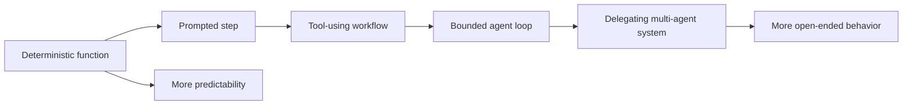

# Agent or workflow: choosing the right amount of autonomy

The word agent is used for systems that differ dramatically. Some are a fixed sequence of API calls with a language model in one step. Others select tools, maintain state, delegate work and decide when they are finished. Treating both as the same hides important engineering choices.

## A useful spectrum

Think of autonomy as a design variable, not a binary property.

A deterministic function has a fixed input, a fixed procedure and a testable output. A prompted step introduces model variability but leaves control flow outside the model. A tool-using workflow lets the model select among a small set of operations. A bounded agent loop adds repeated observation and action under explicit stop conditions. A multi-agent system adds delegation, which can improve specialization but also creates more state, latency and failure modes.

## Decision criteria

Use a workflow when:

- The sequence is known in advance.
- The cost of a wrong action is high.
- Inputs and outputs have a stable schema.
- Compliance requires deterministic evidence.
- You can express the policy as ordinary code.

Consider an agent when:

- The path depends on information discovered during execution.
- The number of possible paths is large but the action space can be bounded.
- A human normally performs navigation, selection or interpretation.
- The system can ask for approval before consequential actions.
- The value of flexible planning exceeds the cost of variability.

The strongest production designs are often hybrid. Code owns permissions, state transitions, retries, budgets and stop conditions. The model proposes interpretations, plans or tool arguments inside those boundaries.

## Worked example: incident triage

A weak design asks an agent to investigate an incident, change configuration and close the ticket. A stronger design separates the work:

1. A deterministic collector gathers approved telemetry.
2. A model summarizes symptoms and proposes hypotheses.
3. A policy engine checks whether a diagnostic tool is permitted.
4. A human approves any change to production state.
5. A deterministic verifier checks the result.
6. The system records the evidence and closes or reopens the case.

The model adds value where interpretation is difficult. It does not receive authority merely because it can write a plausible plan.

## The hidden cost of autonomy

More autonomy usually means more possible trajectories. Each additional tool, memory store, delegation step and retry path expands the state space that must be tested. It also makes debugging harder because a failure may arise from the model, the context, the tool, the policy, the data or the handoff between agents.

A simple planning heuristic is:

> Start with the smallest control loop that can produce the desired value, then add autonomy only when a measured limitation justifies it.

## Exercise

Take a workflow you know and label each step as one of these:

- Fixed transformation
- Retrieval or lookup
- Interpretation
- Decision
- External action
- Verification

Now mark which steps need model flexibility and which steps must remain deterministic. If the only model-dependent step is interpretation, you may not need an agent at all.

## Further reading

- [LangGraph overview](https://docs.langchain.com/oss/python/langgraph/overview) — implementation reference for stateful and long-running graphs.
- [Google Agent Development Kit](https://adk.dev/) — code-first framework documentation.
- [NIST AI Risk Management Framework](https://www.nist.gov/itl/ai-risk-management-framework) — governance context for deciding how risk should be managed.
