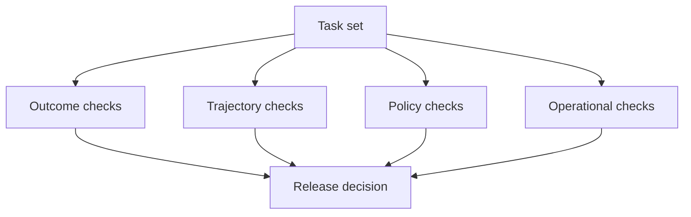

# Agent evaluation and observability: test the trajectory

A final answer is only one observation of an agent run. A system may reach the right answer by using an unsafe tool, leaking data, making unnecessary calls or relying on a lucky retry. Evaluation must therefore measure both the outcome and the path.

## Four layers of evaluation



### Outcome checks

Did the result satisfy the task contract? Use exact checks where possible: schema validation, tests, reconciliations, expected state transitions or human review rubrics.

### Trajectory checks

Did the agent select appropriate tools, use enough evidence, respect stop conditions and recover correctly? Trajectory checks should inspect tool names, arguments, order, retries, delegation and state mutations.

### Policy checks

Did the run stay within permission, privacy, safety and approval boundaries? A correct output does not excuse a policy violation.

### Operational checks

What did the run cost? Measure latency, token volume, tool time, failure rate, queue time, retries and resource utilization.

## Build an evaluation set

Start with representative tasks, not only easy demonstrations. Include:

- Normal cases
- Missing or conflicting evidence
- Ambiguous requests
- Tool failures and timeouts
- Permission denials
- Prompt injection attempts
- Stale state
- Duplicate requests
- Human approval delays
- Cancellation and recovery

Store the expected behavior and acceptable alternatives. A fixed set turns every production failure into a possible regression test.

## Observability schema

A useful trace can include:

```text
run_id
parent_run_id
agent_id and skill_version
request classification
model calls and model versions
tool calls and sanitized arguments
retrieval references
state reads and writes
policy decisions
human approvals
latency and cost
outcome and verifier result
error and recovery status
```

Capture enough to reconstruct the run, but do not log secrets or raw sensitive data by default. Redaction and retention rules are part of observability design.

## Metrics that resist vanity

Prefer measures tied to the task:

- Success rate under a defined rubric
- Unsafe-action rate
- Evidence coverage
- Correct tool-selection rate
- Recovery success rate
- Human escalation rate
- Cost per successful task
- P95 latency per successful task
- Regression rate after a skill or model change

A higher answer score with a higher unsafe-action rate is not an improvement.

## Release gate

Before enabling a new skill or model, require:

1. Evaluation-set results compared with the current version.
2. No critical policy regressions.
3. Known failure modes documented.
4. Trace and redaction checks passed.
5. Rollback path tested.
6. Human review for high-impact workflows.

## Further reading

- [OpenTelemetry GenAI semantic conventions](https://opentelemetry.io/docs/specs/semconv/gen-ai/) — telemetry vocabulary and structure.
- [OWASP Agent Observability Standard](https://owasp.org/www-project-agent-observability-standard-2/) — observability-oriented security guidance.
- [Arize Phoenix](https://github.com/Arize-ai/phoenix) — open-source reference for AI observability and evaluation workflows.
- [NVIDIA guide to evaluating AI agents](https://developer.nvidia.com/blog/how-to-evaluate-ai-agents-from-tool-calls-to-task-completion/) — practical discussion of tool calls and task completion.
