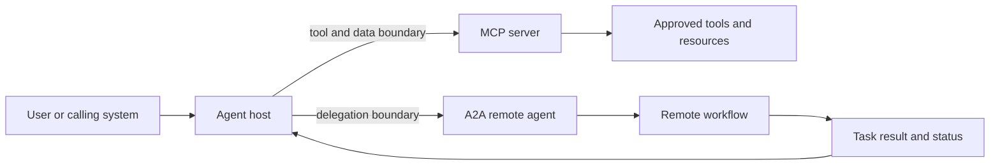

# Protocols: MCP, A2A and the boundaries between systems

Interoperability is not one problem. A model-driven application may need to connect to tools and data, while one agent may need to delegate work to another agent owned by a different team. These boundaries have different trust, identity and failure assumptions.

## Two useful boundaries

| Boundary | Main question | Representative protocol |
| --- | --- | --- |
| Application to tool or data source | How can an AI application discover and invoke capabilities? | Model Context Protocol |
| Agent to remote agent | How can one agent delegate a task and receive progress or a result? | Agent2Agent |

The protocols are complementary rather than interchangeable. A remote agent may use a tool protocol internally, while a host application may use a tool protocol without using agent-to-agent delegation.

## What a protocol does not solve

A protocol can standardize message shapes and interaction patterns. It does not automatically answer:

- Who is allowed to call a capability?
- Is the data trustworthy?
- Is a result current?
- Can the action be reversed?
- Who owns the remote agent?
- What happens when a task is abandoned?
- How is sensitive context prevented from crossing a boundary?

Those are architecture, identity, policy and governance questions.

## Designing a safe tool boundary

Treat each tool as an API with a threat model. Define the caller identity, resource scope, input validation, output filtering, rate limit, timeout, audit record and revocation path. Prefer read-only tools for early experiments. Split a dangerous operation into preview and commit phases so the agent can propose a change before authority is exercised.

## Designing a safe delegation boundary

A delegated task should include:

- Objective and success criteria
- Context that the remote agent is authorized to receive
- Deadline and budget
- Allowed side effects
- Required evidence in the result
- Cancellation behavior
- Identity of the calling agent and accountable owner

Do not pass the entire conversation by default. Minimize context and make the data boundary visible in the trace.

## Protocol selection exercise

For each interaction in a system, classify it as:

1. Local function call
2. Tool or data-source call
3. Remote agent delegation
4. Human approval
5. Event or notification

Then identify the protocol, identity and audit requirements for each. If every interaction is labeled simply "agent communication," the design is not specific enough to review.

## Reference shelf

- [Model Context Protocol getting started guide](https://modelcontextprotocol.io/docs/2026-07-28/getting-started/intro) — official introduction to the tool and context boundary.
- [Model Context Protocol specification](https://modelcontextprotocol.io/specification/2026-07-28) — protocol-level reference.
- [Google's A2A announcement](https://developers.googleblog.com/en/a2a-a-new-era-of-agent-interoperability/) — official explanation of the agent interoperability goal.
- [A2A project](https://github.com/a2aproject/A2A) — implementation and specification repository.
