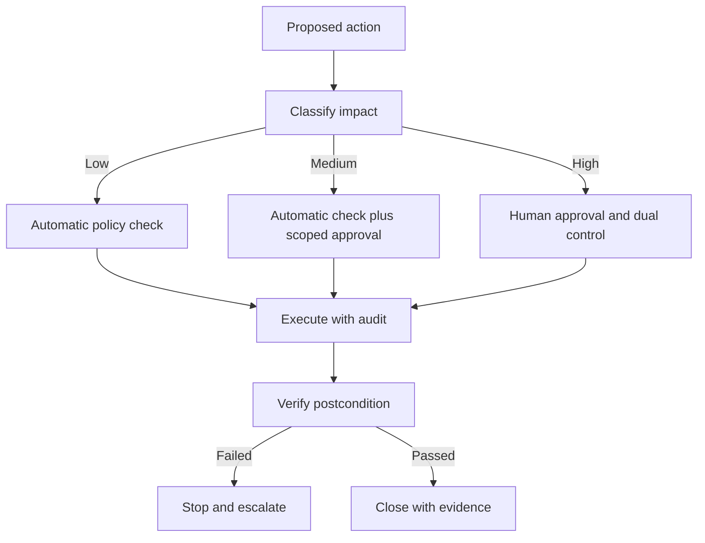

# Security and recovery: bounding agentic action

Agents combine interpretation with authority. That combination creates risks that ordinary application security controls must address explicitly. A prompt injection can change what the model proposes; an over-privileged tool can turn that proposal into a harmful action.

## Threat map

| Threat | What can happen | Primary control |
| --- | --- | --- |
| Prompt injection | External content changes the plan | Treat retrieved text as data; validate actions |
| Tool abuse | The agent uses a capability outside intent | Least privilege and per-call authorization |
| Data exfiltration | Sensitive content crosses a boundary | Data classification, filtering and egress policy |
| Memory poisoning | Persistent state influences future runs | Provenance, review and scoped memory |
| Excessive autonomy | High-impact action occurs without approval | Risk tiers and human gates |
| Replay or duplication | A retry repeats a side effect | Idempotency keys and transaction checks |
| Supply-chain risk | A skill or tool introduces hidden behavior | Pin versions, review provenance and test |

The [OWASP AI Agent Security Cheat Sheet](https://cheatsheetseries.owasp.org/cheatsheets/AI_Agent_Security_Cheat_Sheet.html) is a useful practical reference for these classes of risk.

## Risk-tiered actions

Not all actions need the same friction. A read-only lookup may be automatic. Sending an external message may require confirmation. Changing production state, moving money or deleting data may require a human with appropriate authority and a reversible transaction.

## Recovery is a design feature

A robust agent does not only know how to act; it knows how to stop. Recovery patterns include:

- **Retry:** repeat only when the operation is safe and failure is transient.
- **Backoff:** reduce load when a dependency is unavailable.
- **Compensation:** perform a documented reverse action when possible.
- **Checkpoint:** persist progress before a risky step.
- **Escalation:** transfer control with a complete evidence packet.
- **Quarantine:** isolate suspicious data, memory or tools.
- **Decommission:** revoke an agent identity and disable its skills.

Never use an unconstrained retry loop as a substitute for recovery design.

## Prompt injection is a control-flow problem

It is tempting to solve injection only with a better system prompt. A safer approach assumes that untrusted text may contain instructions and separates data from authority. Retrieval results should be labeled as untrusted evidence. Tool arguments should be validated by code. Privileged operations should require an independent policy decision.

## Incident response questions

When an agent behaves unexpectedly, ask:

1. What was the earliest unsafe proposal?
2. Which untrusted input influenced it?
3. Which control should have blocked it?
4. Did the trace preserve enough evidence?
5. Was any external state changed?
6. Can the change be reversed?
7. Which evaluation case will prevent recurrence?

## Further reading

- [OWASP AI Agent Security Cheat Sheet](https://cheatsheetseries.owasp.org/cheatsheets/AI_Agent_Security_Cheat_Sheet.html) — practical threat and control guidance.
- [NIST AI Risk Management Framework](https://www.nist.gov/itl/ai-risk-management-framework) — broader risk-management foundation.
- [Google guidance on agent interoperability](https://developers.googleblog.com/en/a2a-a-new-era-of-agent-interoperability/) — useful context for cross-agent boundaries.
