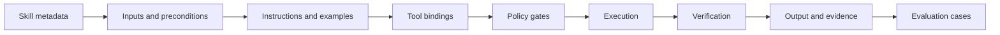

# Agentic skills: packaging reusable expertise

A skill is a reusable capability with a clear purpose, inputs, procedure, constraints and expected outputs. It may contain instructions, tool bindings, examples, validators and tests. Calling every prompt a skill makes the term meaningless; a skill should be something another agent or workflow can discover and invoke consistently.

## A skill contract

A practical contract contains:

```text
name: incident-summary
purpose: produce an evidence-linked incident summary
inputs: incident identifier and time window
outputs: structured summary with evidence references
allowed tools: read-only telemetry and ticket lookup
forbidden actions: configuration changes and ticket closure
approval policy: human approval for external communication
verification: schema validation and evidence coverage check
failure behavior: return an incomplete status with missing evidence
```

The contract is part of the safety boundary. The prose instructions may help a model reason, but the runtime must enforce permissions and output validation.

## Instruction, tool, workflow or skill?

These terms are useful when kept distinct:

- **Instruction:** guidance for a single model invocation.
- **Tool:** an operation exposed through an interface.
- **Workflow:** a known sequence of steps.
- **Skill:** a reusable capability that combines guidance, tools, constraints and verification.
- **Agent:** a runtime that selects and coordinates capabilities under an objective.

A skill can be implemented as a workflow, but it should expose a stable contract even if the internal implementation changes.

## Skill anatomy



A mature skill has an owner, version, changelog, security review status and deprecation policy. It is a product surface, not only a prompt file.

## Discovery and composition

Discovery should filter by more than name. Useful metadata includes domain, required permissions, data sensitivity, expected latency, cost range, supported input schema and trust level. Composition should be explicit: the output schema of one skill must satisfy the input contract of the next.

Avoid composing skills solely because their descriptions sound compatible. Validate the actual data shape, authority boundary and failure behavior.

## Versioning and change control

A skill change can alter behavior even when its interface is unchanged. Track:

- Contract version
- Prompt or policy version
- Tool versions
- Evaluation-set version
- Known limitations
- Rollback target

Use a small regression set for every skill. Add a case whenever production reveals a new failure. A skill that cannot be evaluated independently is difficult to trust when composed into a larger agent.

## Skill quality checklist

Before publishing a skill, ask:

- Is the purpose narrower than a vague role such as "be helpful"?
- Are inputs and outputs structured?
- Are side effects listed?
- Are permissions enforced outside the model?
- Is there a verifier or acceptance test?
- Is the failure response useful and non-deceptive?
- Can a reviewer reproduce a run from its trace?
- Is there an owner and a rollback path?

## Thought experiment

If a skill can silently call any tool available to its host, is it reusable? Or is it merely a privileged prompt? The difference is whether the capability has a bounded and inspectable contract.

## Further reading

- [Model Context Protocol specification](https://modelcontextprotocol.io/specification/2026-07-28) — standard context and tool integration boundary.
- [Google ADK documentation](https://adk.dev/) — examples of agents, tools and multi-agent composition.
- [OWASP AI Agent Security Cheat Sheet](https://cheatsheetseries.owasp.org/cheatsheets/AI_Agent_Security_Cheat_Sheet.html) — security controls that belong in skill design.
