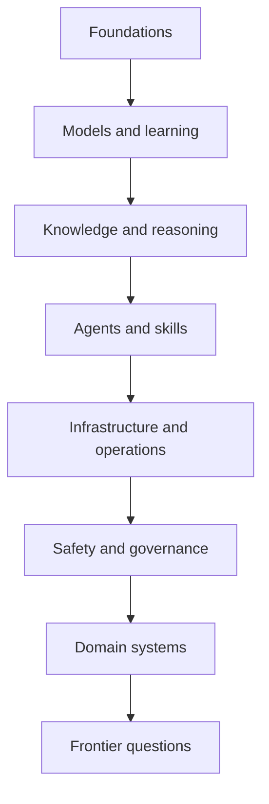

# AI atlas roadmap

The atlas is organized by questions rather than by vendor or product.

## 1. Foundations

Mathematics, statistics, optimization, classical machine learning, neural networks, embeddings, generalization, scaling, and evaluation.

## 2. Learning paradigms

Supervised, unsupervised, self-supervised, reinforcement, offline, model-based, multi-agent, continual, federated, active, meta-, and curriculum learning.

## 3. Model families

Transformers, language models, vision models, speech models, multimodal models, diffusion, graph neural networks, mixture-of-experts, world models, causal models, and hybrid systems.

## 4. Knowledge and reasoning

RAG, vector search, hybrid search, reranking, graph RAG, multimodal RAG, long-context methods, memory, planning, reasoning, verification, and tool-augmented inference.

## 5. Agents and skills

Workflows, agents, tools, function calling, memory, permissions, planning loops, multi-agent systems, human oversight, reusable skills, agentic skills, and interoperability.

## 6. Engineering and infrastructure

Data pipelines, pretraining, fine-tuning, parameter-efficient tuning, distillation, quantization, serving, inference optimization, accelerators, observability, evaluation, and cost.

## 7. Safety and governance

Reliability, hallucination, bias, privacy, copyright, interpretability, adversarial attacks, prompt injection, model risk, standards, regulation, and assurance.

## 8. Applications and environments

Enterprise AI, software engineering, science, robotics, cybersecurity, healthcare, finance, manufacturing, education, telecom, autonomous networks, edge AI, and IT operations.

## 9. Frontier questions

World models, embodied intelligence, self-improvement, collective intelligence, AI-native organizations, human-AI collaboration, neuromorphic systems, and the limits of scaling.

## A layered learning path

Each topic should be readable at four levels:

1. Orientation — what it is and why it matters
2. Mechanics — how it works
3. Engineering — how to build and evaluate it
4. Industry context — where it is being used and what evidence exists
