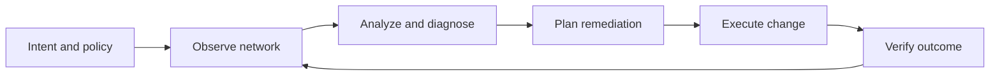

# Autonomous networks

## The opening puzzle

Is an autonomous network one that makes decisions without humans, or one that helps humans operate a much larger system safely?

Autonomy is better understood as a spectrum. A system may automate a narrow action, coordinate a workflow, recommend a change, execute within a policy boundary, or manage a closed loop with limited intervention.

## The closed loop

## Design ingredients

* Observability and trustworthy telemetry
* Intent representation and policy constraints
* Diagnosis and root-cause reasoning
* Orchestration and change execution
* Verification and rollback
* Human oversight and escalation
* Security, identity, and auditability

## Why the adjacent AI concepts matter

* RAG can connect operational decisions to runbooks and standards.
* Reinforcement learning can optimize sequential decisions, but reward design is critical.
* Agents can coordinate tools across assurance and orchestration systems.
* Skills can package repeatable operational procedures.
* Digital twins can provide safer environments for testing changes.

## Engineering reality

Network autonomy is not just a model problem. It depends on data quality, system integration, policy clarity, observability, and the ability to verify or reverse an action.

## Thought experiment

If an autonomous system is excellent at local optimization but unaware of a broader service objective, has it become more autonomous or merely more dangerous?
