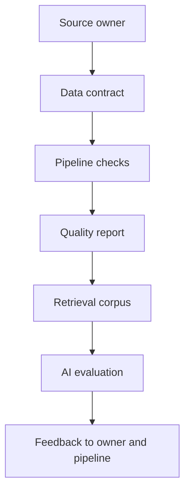

# Data as a product

A dataset becomes a product when people can discover it, understand its intended use, trust its quality, and depend on a predictable interface. This is a stronger standard than placing files in a shared folder or exposing a table through an API.

## The data-product contract

A useful contract describes:

* **Purpose:** the decisions, models, or workflows the data is intended to support
* **Grain:** what one row, event, document, or observation represents
* **Schema:** fields, types, units, identifiers, and allowed values
* **Freshness:** when data is produced, updated, and considered stale
* **Quality:** completeness, validity, consistency, uniqueness, and accuracy indicators
* **Provenance:** where each important field came from and what transformations occurred
* **Access:** who may read, transform, export, or delete the data
* **Change policy:** how schema changes and breaking changes are announced

The contract is not bureaucracy. It is the interface between the data producer and every downstream consumer, including retrieval indexes, feature pipelines, evaluation sets, and human reviewers.

## Why AI systems expose weak contracts

Traditional reporting may tolerate a stale value if a user notices it in a dashboard. A generative system can turn the same stale value into a confident paragraph, repeat it across many interactions, and make it harder to see where the error originated. AI increases the distribution and fluency of data-derived errors.

## A practical quality matrix

| Dimension | Diagnostic question | Typical symptom |
|---|---|---|
| Completeness | Are required fields present? | Answers omit a critical constraint |
| Validity | Do values conform to the schema? | Filters and tools behave unpredictably |
| Consistency | Do sources agree on meaning and units? | Conflicting answers across channels |
| Freshness | Is the item current for the decision? | Old policy or stale operational state |
| Lineage | Can we trace the value to origin? | No defensible explanation |
| Accessibility | Can the authorized user retrieve it? | Missing context or silent bias |

## Design pattern: ownership plus observability

Assign an owner for meaning and an owner for the pipeline. Track quality signals at ingestion and again after transformation. A clean source can become a poor retrieval corpus after parsing, chunking, redaction, or indexing.

## Engineering exercise

Choose a public dataset or a small collection of documents. Write a one-page contract with purpose, grain, freshness, quality checks, provenance, access assumptions, and a deletion procedure. Then list three ways an AI assistant could misuse the data even if every row is technically valid.

## Further reading

* [Data contracts, by Andrew Jones](https://datacontract.com/) — a practical perspective on treating data interfaces explicitly.
* [Great Expectations](https://github.com/great-expectations/great_expectations) — open-source data validation tooling.
* [OpenLineage](https://openlineage.io/) — an open standard and ecosystem for lineage metadata.

## Think deeper

If a data product is optimized for model retrieval but difficult for a human to inspect, has it become more useful or less trustworthy? Explain which design choices would preserve both machine utility and human accountability.
