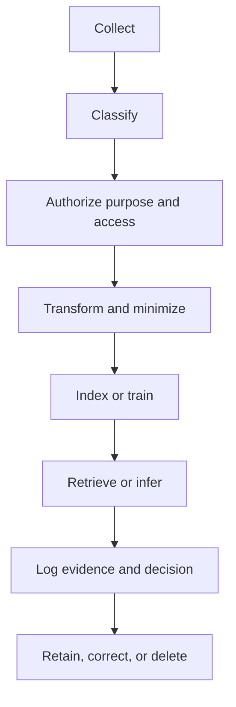

# Data quality and governance

Data governance becomes concrete when an AI system must answer questions such as: who may use this source, for what purpose, until when, with which transformations, and with what evidence? Policies that cannot be enforced or observed are aspirations, not controls.

## Governance checkpoints

At each checkpoint, define the control, its owner, the observable signal, and the response when it fails.

## Provenance and lineage

For an AI answer, provenance should answer more than “which document was cited?” It may need to show source version, extraction step, chunk identifier, access decision, retrieval score, model version, and post-processing. This is especially important when a result is used to support an operational decision.

## Freshness and deletion

A source may change, expire, be corrected, or become restricted. Indexes and caches must reflect lifecycle events. Deletion is not complete if a document disappears from the primary store but remains in an embedding index, cache, evaluation set, prompt archive, or generated derivative.

## Governance anti-patterns

* A single “approved” label with no purpose or scope.
* Access checks performed only after generation.
* No owner for a shared corpus.
* Retention rules that exclude derived artifacts.
* A policy page with no technical test or audit evidence.
* Treating citations as proof of permission.

## Engineering exercise

Choose a small public corpus and design a lifecycle table with source owner, purpose, access class, freshness window, retention rule, deletion propagation, and audit event. Then simulate a correction and a deletion request. List every system that must change.

## Further reading

* [NIST Privacy Framework](https://www.nist.gov/privacy-framework) — privacy risk management.
* [W3C Data Privacy Vocabularies](https://www.w3.org/TR/dpv/) — vocabulary for describing personal data and processing.
* [OpenLineage](https://openlineage.io/) — lineage metadata and integration ecosystem.
* [Apache Atlas](https://github.com/apache/atlas) — metadata and governance platform.

## Thought experiment

Who is accountable when a model uses an outdated but correctly cited source? The answer should identify responsibilities across source ownership, indexing, product design, and user decision-making—not assign blame to the model alone.
