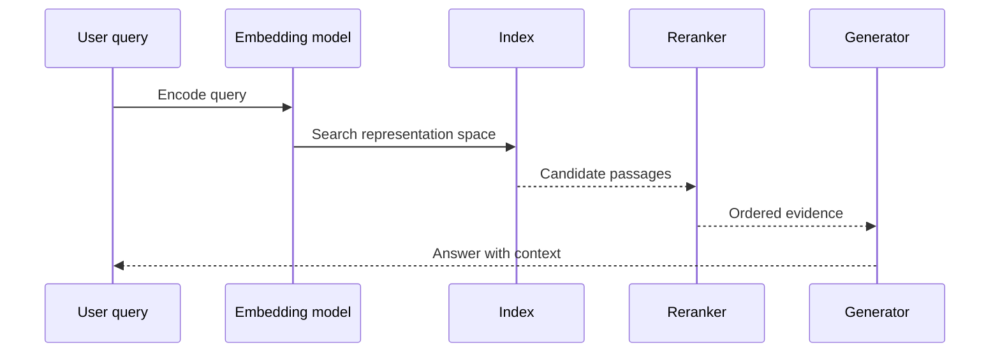

# Embeddings and representations

An embedding maps an item into a numerical space so that some relationships become easier to compare. Text, images, audio, users, products, and events can all be represented this way. The important phrase is **some relationships**: an embedding is not a universal measure of meaning.

## What an embedding preserves

A representation is useful when distances or directions in its space correlate with a task. Similar support questions may be near each other. A picture and its caption may align. A sequence of events may encode a pattern useful for prediction.

But proximity can reflect unwanted properties: writing style, popularity, language, source bias, document length, or the training distribution. A nearest neighbor is evidence of representational similarity, not proof of identity, truth, authority, or causal relevance.

## The retrieval path

The embedding model and the index must be evaluated together. A better embedding model can still produce a worse system if chunk boundaries, metadata filters, language coverage, or index settings are wrong.

## Important trade-offs

* **Dimension:** larger vectors may encode more variation but increase storage and compute cost.
* **Metric:** cosine similarity, dot product, and Euclidean distance make different assumptions.
* **Granularity:** paragraph, section, document, event, and entity embeddings answer different retrieval questions.
* **Domain fit:** general models may miss specialist terminology or local meaning.
* **Multilingual behavior:** quality may vary substantially across languages and scripts.
* **Versioning:** changing the embedding model usually requires re-indexing and evaluation.

## Metadata is not optional

A vector without metadata is difficult to govern. Store source identifier, version, timestamp, access scope, language, content type, and transformation history. Retrieval should filter by authorization and lifecycle state before or during similarity search, not after an answer has already been generated.

## Common failure modes

* Nearest-neighbor search returns a near-duplicate rather than the best evidence.
* Chunking separates a definition from its constraints.
* A similarity score is mistaken for confidence.
* Index recall is measured without checking answer usefulness.
* A new embedding model is deployed without regression tests.

## Lab prompt

Create a small corpus with at least three document types. Compare fixed-size chunks with structure-aware chunks. For ten queries, record the top five results, their source authority, and whether the answer could be supported from them. Do not evaluate only the final prose; inspect the retrieved evidence.

## Further reading

* [Sentence Transformers documentation](https://www.sbert.net/) — embedding and reranking concepts with implementation examples.
* [FAISS documentation](https://github.com/facebookresearch/faiss) — indexing methods and similarity search.
* [MTEB benchmark](https://github.com/embeddings-benchmark/mteb) — a broad benchmark suite for text embedding models.

## Thought experiment

If two documents are close in embedding space but disagree on policy, what should the system do? Design a retrieval policy that uses similarity as one signal while preserving authority, recency, and scope.
