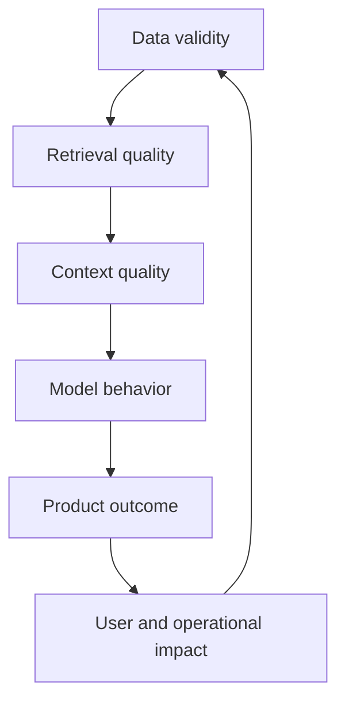

# Evaluation and data-centric debugging

Many AI teams ask whether a model is good before asking whether the data and task definition are good. Data-centric debugging reverses that order. It examines the examples, labels, evidence, retrieval behavior, and user context that shape the observed result.

## A layered evaluation stack

A failure at a higher layer may be caused by any lower layer. Diagnose from the evidence, not from assumptions about the model.

## Build an evidence ledger

For every test case, record:

* User task and expected outcome
* Source set and source versions
* Retrieved candidates and ranking
* Context presented to the model
* Model and prompt configuration
* Claims made in the output
* Evidence supporting each claim
* Unsupported or contradicted claims
* Latency, cost, and tool calls
* Reviewer judgment and failure category

This turns “the answer felt wrong” into a reproducible debugging artifact.

## Failure taxonomy

* **Coverage failure:** the correct source was absent.
* **Parsing failure:** the source existed but was extracted incorrectly.
* **Retrieval failure:** relevant evidence was not returned.
* **Ranking failure:** evidence was present but buried.
* **Context failure:** useful evidence was truncated, duplicated, or mixed with conflict.
* **Generation failure:** the model misread or invented content.
* **Policy failure:** the system answered outside its authority.
* **Product failure:** the interface encouraged an unsafe interpretation.

## Metrics should match risk

Use retrieval metrics for retrieval problems, groundedness and citation checks for evidence problems, task success for workflow problems, and operational metrics for production behavior. A single aggregate score hides the failure modes that need action.

## Lab: evidence ledger

Construct an evaluation set with ordinary, ambiguous, adversarial, and insufficient-evidence questions. Run two retrieval configurations. Complete an evidence ledger for every case, then prioritize fixes by user harm, frequency, and reversibility rather than by benchmark score alone.

## Further reading

* [RAGAS](https://github.com/explodinggradients/ragas) — evaluation components for RAG systems.
* [DeepEval](https://github.com/confident-ai/deepeval) — testing and evaluation framework for LLM applications.
* [HELM](https://crfm.stanford.edu/helm/latest/) — holistic language-model evaluation perspective.
* [MLflow](https://github.com/mlflow/mlflow) — experiment tracking and evaluation tooling.

## Thought experiment

A benchmark rises after removing hard questions. Did the system improve? Define a release gate that prevents metric improvement from being confused with capability improvement.
