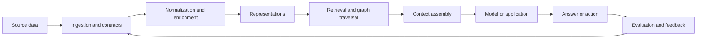

# Data and knowledge systems

Modern AI systems do not become useful merely because a model is capable. They become useful when the right information is available, represented with appropriate context, retrieved at the right time, governed carefully, and evaluated against the work people actually need to do.

This module follows the path from raw data to dependable knowledge experiences. It covers data as a product, embeddings, retrieval, knowledge graphs, RAG architectures, synthetic data, governance, and data-centric evaluation.

## The central question

> When an AI system gives a plausible answer, how do we know that it had access to the right evidence, interpreted it correctly, and used it within its authority?

## What you will learn

* How data quality and data contracts shape model behavior
* Why embeddings are useful but not equivalent to understanding
* How lexical, vector, hybrid, and graph retrieval differ
* Where knowledge graphs complement language models
* How to design RAG systems beyond a single vector search
* When synthetic data helps and when it amplifies errors
* How provenance, freshness, access control, and deletion requirements affect architecture
* How to debug an AI system by examining data and evidence rather than only the model

## A system view

The loop matters. A weak answer may be caused by missing data, stale data, a bad chunk, a retrieval miss, an authorization error, poor context assembly, or an incorrect model inference. Treating every failure as a prompting problem hides the real source of risk.

## Suggested path

Start with data as a product, then study representations and retrieval. Continue to graphs and RAG architectures before exploring synthetic data and governance. Finish with the evidence-ledger lab: it turns abstract quality principles into a repeatable debugging practice.

## External reference shelf

* [NIST AI Risk Management Framework](https://www.nist.gov/itl/ai-risk-management-framework) — governance and risk context for data and AI systems.
* [FAISS](https://github.com/facebookresearch/faiss) — a widely used library for similarity search and dense-vector indexing.
* [Sentence Transformers](https://www.sbert.net/) — practical documentation for embedding and reranking models.
* [pgvector](https://github.com/pgvector/pgvector) — vector similarity search in PostgreSQL.
* [W3C PROV](https://www.w3.org/TR/prov-overview/) — a provenance model useful for evidence and lineage discussions.

## Thought experiment

Suppose an assistant answers a question using a document that was correct yesterday but revoked today. Is the primary failure in retrieval, access control, freshness management, model behavior, or the product contract? Design a system that can distinguish these cases.
