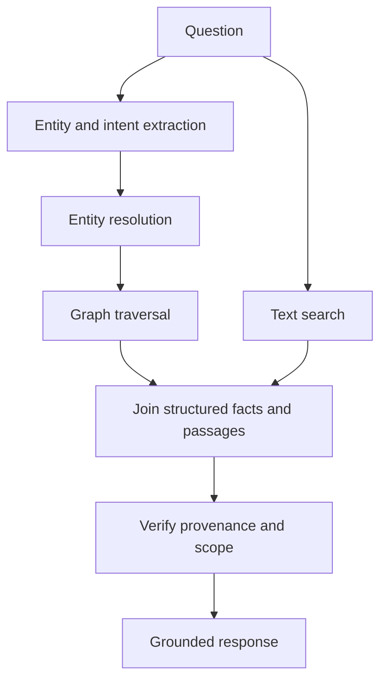

# Knowledge graphs and ontologies

A knowledge graph represents entities, relationships, attributes, and provenance in a form that supports explicit traversal. An ontology supplies shared concepts and constraints: what kinds of things exist, how they relate, and what statements are valid.

Graphs do not replace language models. They provide a different substrate for identity, constraints, multi-hop reasoning, and explainable relationships.

## Where graphs help

* Resolving that two names refer to the same entity
* Traversing dependencies, ownership, and topology
* Enforcing type and relationship constraints
* Explaining how a conclusion follows from linked facts
* Combining structured operational data with unstructured documents
* Supporting questions where connection structure matters more than textual similarity

## Graph-assisted retrieval

## Ontology versus schema

A schema describes the shape of data in a particular system. An ontology is a more explicit model of meaning and relationships, often intended to support interoperability across systems. In practice, projects use a spectrum: relational schemas, taxonomies, controlled vocabularies, knowledge graphs, and formal ontologies.

Start with the questions the system must answer. Modeling every possible concept before the first use case usually creates a brittle project. Model stable identities, important relationships, provenance, and constraints first.

## Failure modes

* Entity resolution creates false merges that contaminate every downstream answer.
* A graph encodes a contested interpretation as if it were neutral fact.
* Provenance is lost when data is transformed into triples.
* The ontology is more detailed than the data can support.
* A graph query is treated as complete when the graph is only a partial view.

## Lab prompt

Take a small public domain such as a software dependency graph, scientific bibliography, or transit network. Define ten entity types, ten relationship types, and provenance fields. Write five questions that text retrieval alone handles poorly, then compare a graph-assisted answer with a text-only answer.

## Further reading

* [W3C RDF 1.1 Concepts](https://www.w3.org/TR/rdf11-concepts/) — foundational graph data model.
* [W3C OWL 2 Web Ontology Language](https://www.w3.org/OWL/) — formal ontology standards.
* [Neo4j GraphAcademy](https://graphacademy.neo4j.com/) — practical graph learning materials.

## Thought experiment

If a graph makes an answer more explainable but encodes an outdated organizational structure, is it safer than an opaque model? Explain how freshness and provenance should appear in the user experience.
