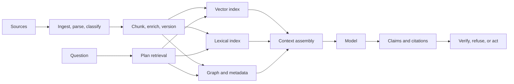

# RAG beyond vector search

Retrieval-augmented generation is often reduced to a diagram with an embedding model, a vector database, and a language model. That diagram is useful for orientation but incomplete for production. Dependable RAG is a knowledge-access system with ingestion, indexing, retrieval, authorization, context construction, generation, verification, and feedback.

## A fuller architecture

## The design choices that matter

* **Chunking:** preserve headings, tables, definitions, exceptions, and references.
* **Metadata:** retain source, version, audience, authority, language, timestamps, and access scope.
* **Retrieval:** combine exact, semantic, structured, and graph signals when the task requires it.
* **Context:** remove duplicates, resolve conflicts, and keep enough surrounding evidence.
* **Generation:** instruct the model to distinguish evidence, inference, and uncertainty.
* **Verification:** check claims against sources; do not equate fluent citation with faithful citation.
* **Feedback:** capture unanswered questions, retrieval misses, stale sources, and user corrections.

## RAG does not automatically make answers true

Retrieval can improve grounding when the corpus is relevant and the model uses it faithfully. It can also make an incorrect answer more persuasive when the retrieved evidence is weak, contradictory, or misinterpreted. The system must expose evidence quality and uncertainty rather than hide them behind polished prose.

## Advanced patterns

* **Corrective RAG:** detect weak retrieval and retry with a different strategy.
* **Adaptive RAG:** vary retrieval depth based on question complexity.
* **Graph RAG:** use entities and relationships for global or multi-hop questions.
* **Agentic retrieval:** let a bounded planner perform several searches with explicit stopping rules.
* **Multimodal RAG:** retrieve images, tables, diagrams, and audio alongside text.

## Practical exercise

Create a ten-question evaluation set for a small public corpus. For each answer, record retrieved sources, supported claims, unsupported claims, citation correctness, latency, and cost. Add two questions whose correct response is “insufficient evidence.” A system that never refuses is not necessarily a good system.

## Further reading

* [Retrieval-Augmented Generation for Knowledge-Intensive NLP Tasks](https://arxiv.org/abs/2005.11401) — foundational RAG paper.
* [RAGAS](https://github.com/explodinggradients/ragas) — open-source RAG evaluation framework.
* [LlamaIndex](https://github.com/run-llama/llama_index) — data and context framework for LLM applications.

## Thought experiment

What should happen when the retrieved sources disagree? Rank by authority, present the conflict, ask a clarifying question, or refuse? The right answer depends on the decision risk and should be part of the product contract.
