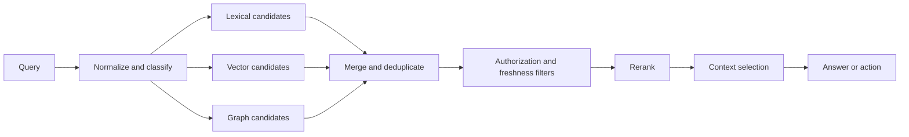

# Retrieval systems

Retrieval is the discipline of finding a small, useful, authorized evidence set from a large corpus. It is often described as a search problem, but production retrieval is a pipeline of query understanding, candidate generation, filtering, ranking, compression, and evidence packaging.

## Four retrieval families

| Family | Strength | Weakness |
|---|---|---|
| Lexical | Exact terms, identifiers, explainability | Misses paraphrases and vocabulary mismatch |
| Dense vector | Semantic similarity and paraphrase tolerance | Can miss exact constraints and authority differences |
| Hybrid | Combines lexical and semantic signals | More tuning and evaluation complexity |
| Graph traversal | Explicit relationships and multi-hop structure | Requires maintained entities and relationships |

No family is universally best. The query determines the retrieval problem. An incident identifier may demand lexical search. A conceptual question may benefit from dense retrieval. A question about dependencies may require graph traversal.

## A production retrieval pipeline

## Evaluation layers

Evaluate retrieval before generation:

* **Recall at k:** did the relevant evidence appear in the candidate set?
* **Precision at k:** how much of the candidate set is useful?
* **Ranking quality:** are the best items near the top?
* **Diversity:** does the set cover distinct relevant aspects?
* **Freshness and authority:** are current, approved sources favored?
* **Access correctness:** are restricted items excluded or correctly scoped?

Then evaluate the complete experience: groundedness, completeness, citation correctness, refusal behavior, latency, and cost.

## Query rewriting is a trade-off

Rewriting can expand ambiguous language and add synonyms, but it can also erase constraints or introduce an interpretation the user did not intend. Preserve the original query, record rewrites, and compare retrieved evidence against both when the task is high impact.

## Engineering exercise

Build a small retrieval benchmark with at least 20 questions and a gold evidence set for each. Compare lexical, vector, and hybrid retrieval. Add one adversarial set containing exact identifiers, negations, dates, and conflicting versions. Report where each approach fails and which failures are acceptable for the intended product.

## Further reading

* [Apache Lucene](https://lucene.apache.org/) — foundational information-retrieval library.
* [Vespa learning resources](https://github.com/vespa-engine/vespa) — large-scale search, ranking, and serving.
* [BEIR benchmark](https://github.com/beir-cellar/beir) — heterogeneous information-retrieval evaluation.

## Think deeper

Should a retrieval system return a highly similar source that is unauthorized, or no source at all? The correct answer is usually obvious, but the difficult design question is how to make the system fail visibly rather than silently.
