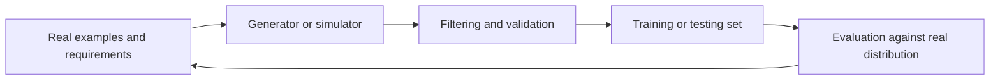

# Synthetic data and data generation

Synthetic data is generated rather than directly observed, but “synthetic” covers many different practices: simulation, augmentation, privacy transformations, generated examples, counterfactuals, and model-produced labels. Each has different benefits and failure modes.

## Why generate data?

* Increase coverage of rare or costly cases
* Create controlled scenarios for testing
* Protect sensitive information when the transformation is appropriate
* Produce labels or explanations for unlabeled data
* Explore counterfactuals and edge conditions
* Exercise an agent or system before exposing it to real environments

## The synthetic-data loop

Synthetic data is not automatically private, representative, or unbiased. A generator can memorize sensitive examples. A simulator can omit the very failures that matter. Model-generated labels can encode the teacher model’s errors and make them look statistically abundant.

## Validation questions

* Does the synthetic set cover the intended behaviors?
* Does it preserve or distort important relationships?
* Are rare cases realistic rather than merely unusual-looking?
* Can generated records be linked to real individuals or documents?
* Does training on synthetic data improve performance on independently collected real data?
* Are evaluation results inflated because the generator and evaluator share the same biases?

## Useful patterns

* Use synthetic data for coverage and stress testing, not as a substitute for measuring reality.
* Keep real, synthetic, and mixed datasets separately identified.
* Preserve generation prompts, model versions, seeds, filters, and review decisions.
* Establish holdout data that the generator cannot see.
* Test for memorization, leakage, and distribution collapse.

## Lab prompt

Generate a small set of edge cases for a classification or retrieval task. Have a reviewer label realism and usefulness without seeing the generation prompt. Compare performance on real, synthetic, and mixed training sets, and document where synthetic examples harmed generalization.

## Further reading

* [Synthetic Data Generation for Information Retrieval](https://arxiv.org/search/?query=synthetic+data+information+retrieval&searchtype=all) — a starting point for research discovery; evaluate individual papers critically.
* [NIST Privacy Framework](https://www.nist.gov/privacy-framework) — privacy risk management context.
* [SDV](https://github.com/sdv-dev/SDV) — open-source tools for synthetic tabular data.

## Think deeper

If synthetic data improves a benchmark but worsens performance for real users, which metric should win? A useful answer must distinguish optimization target, evidence quality, and deployment risk.
