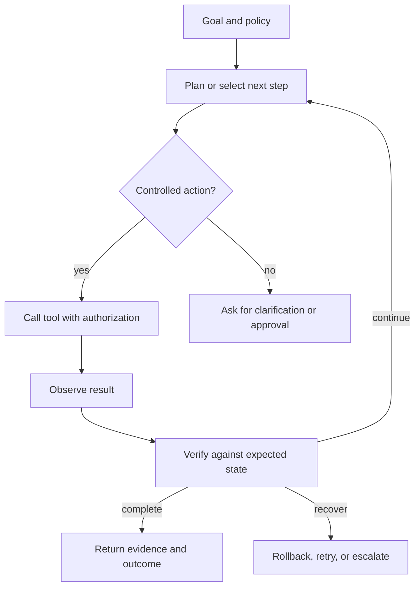

# Agentic systems: workflows, tools, skills, and control

An agent is not defined by a chat interface or by the number of tools it can call. It is a system that can select actions based on a goal, observations, state, and constraints. The important engineering question is not “How autonomous is it?” but “Which decisions are delegated, under what authority, with what evidence, and how can the system recover?”

## Learning objectives

* Distinguish deterministic workflows from adaptive agent loops.
* Design tool contracts and permission boundaries.
* Explain skills as versioned capabilities rather than prompt fragments.
* Choose memory and state mechanisms deliberately.
* Evaluate an agent on task success, safety, efficiency, and recovery.

## Workflow or agent?

A workflow has a known control path. An agent has some control over the next step. Most useful systems are hybrids. Deterministic code should own the high-risk boundaries, while an agent can handle classification, search, drafting, or selection inside a constrained region.

The loop is incomplete without verification. A tool returning HTTP success does not mean the intended state was reached. Verification can be a second read, an invariant check, a policy check, a human confirmation, or a downstream signal.

## Tool contracts

A tool should expose more than a name and a JSON schema. Document:

* Purpose and side effects
* Required identity and authorization
* Input validation and allowed ranges
* Idempotency behavior
* Timeouts and retry rules
* Expected result shape
* Error taxonomy
* Audit fields
* Rollback or compensation behavior

A read-only search tool and a state-changing provisioning tool should not look equivalent to the agent. Make risk visible in the interface. Separate planning permissions from execution permissions. Use allowlists for high-impact actions.

## Skills and agentic skills

A skill is a reusable capability with a contract. A useful skill definition includes its trigger, prerequisites, inputs, procedure, outputs, failure handling, evidence requirements, and evaluation cases. A skill should be versioned independently from the model that invokes it.

An **agentic skill** adds controlled adaptation. It may choose among substeps, ask for missing information, call tools, inspect results, and recover from expected failures. It still needs boundaries. “Be resourceful” is not a safety policy.

A good skill description answers:

* When should this capability be selected?
* What must be true before it starts?
* What actions may it take?
* What information must it never disclose?
* What evidence must it return?
* What counts as success?
* What should happen when the environment disagrees with the plan?

## Memory and state

Conversation history is not a complete memory system. Separate:

* **Working state:** the current task, intermediate results, and pending actions.
* **Episodic memory:** what happened in a prior run.
* **Semantic memory:** durable facts or preferences with provenance.
* **Procedural memory:** skills, policies, and workflows.
* **External state:** the actual system of record.

The agent should not treat its memory as authoritative when an external system can be checked. Memory needs retention, correction, deletion, access control, and provenance rules.

## Worked example: incident triage

A useful incident agent can classify an alert, gather evidence, propose hypotheses, and prepare a change. It should not silently change production because a plausible hypothesis is not a verified diagnosis.

A controlled design might allow:

* Read telemetry and recent changes.
* Group related alerts.
* Draft a timeline with citations.
* Propose one or more hypotheses.
* Generate a reversible change plan.

It might require approval for:

* Restarting a service.
* Changing traffic or policy.
* Modifying credentials.
* Closing or reclassifying the incident.

The design should log the evidence used, the tools called, the authority applied, and the state observed after each action.

## Multi-agent systems

Multiple agents are useful when responsibilities are genuinely separable or when independent proposals improve reliability. They are not automatically better. Coordination introduces message overhead, inconsistent beliefs, duplicated work, and new attack surfaces.

Use separate agents when at least one of these is true:

* They have different tools or permissions.
* They use different evaluation criteria.
* They operate at different timescales.
* Their work can be parallelized safely.
* Independent disagreement is valuable.

A supervisor, shared blackboard, or explicit protocol is usually safer than an unstructured conversation among agents.

## Evaluation

Evaluate an agent at the trajectory level, not only the final answer. Useful measures include:

* Task completion and partial credit
* Correct tool selection
* Invalid or unnecessary calls
* Policy violations
* Recovery success
* Human takeover rate
* Time, token, and tool cost
* Reproducibility under the same state
* Quality of evidence and final explanation

Keep a holdout set of tasks and environment states. A system can learn to pass visible examples while becoming brittle in unseen states.

## Failure modes

* Autonomy without authorization boundaries.
* A planner that can directly execute high-impact actions.
* Retry loops that amplify side effects.
* Memory that outlives the user's permission.
* Tool descriptions that hide destructive behavior.
* Multi-agent consensus mistaken for truth.
* No distinction between “tool call succeeded” and “goal achieved.”

## Exercise: define one safe skill

Choose a read-only task and write a one-page skill contract. Include trigger conditions, inputs, permitted tools, evidence requirements, stop conditions, failure modes, and five evaluation cases. Then create a second version that includes one state-changing action and compare the additional controls it requires.

## Reference shelf

* **Primary:** [Model Context Protocol](https://modelcontextprotocol.io/introduction) — an open protocol for connecting models to tools and context.
* **Primary:** [A2A Protocol](https://a2a-protocol.org/latest/) — an open protocol for agent-to-agent interoperability.
* **Implementation:** [LangGraph documentation](https://langchain-ai.github.io/langgraph/) — stateful orchestration, durable execution, and human-in-the-loop patterns.
* **Implementation:** [Google Agent Development Kit](https://google.github.io/adk-docs/) — an official framework for building agent applications.
* **Security:** [OWASP Agentic AI Threats and Mitigations](https://genai.owasp.org/resource/agentic-ai-threats-and-mitigations/) — risks specific to agentic behavior.
* **Research:** [ReAct: Synergizing Reasoning and Acting in Language Models](https://arxiv.org/abs/2210.03629) — a foundational reasoning-and-action pattern.
* **Primary:** [NIST AI RMF Generative AI Profile](https://www.nist.gov/itl/ai-risk-management-framework/ai-rmf-generative-ai-profile) — risk considerations for generative systems.

*Last checked: 2026-09-24.*
