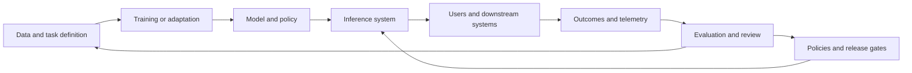

# From model training to dependable learning systems

A model is not an AI system. A model is one component in a system that also includes data, prompts or policies, retrieval, tools, interfaces, evaluation, monitoring, and people. That distinction is the foundation for reasoning about nearly every topic in this atlas.

## Learning objectives

By the end of this chapter you should be able to:

* Separate training-time behavior from inference-time behavior.
* Explain why a strong benchmark score does not guarantee a useful product.
* Identify the feedback loops that improve or degrade an AI system.
* Choose measurements for quality, cost, latency, safety, and operational health.
* Describe where human judgment belongs in an automated system.

## The system model

A useful abstraction is a loop rather than a pipeline. Data enters a system, a model produces behavior, users and operators observe outcomes, and those observations influence the next dataset, evaluation set, prompt, policy, or model version.

The loop has two different clocks. The **fast clock** is inference: requests arrive, the system responds, and operators watch latency and failures. The **slow clock** is learning: teams collect evidence, change data or behavior, evaluate a candidate, and release a new version. Confusing these clocks leads to bad operating decisions. A production incident may need a routing or policy change immediately, while a model change should wait for controlled evaluation.

## Five layers of behavior

### 1. Task and objective

A vague objective such as “answer questions better” hides many decisions. Better for whom? On which data? With what latency? Is a refusal better than a confident but unsupported answer? A task definition should specify the user, the permitted actions, the expected output, and the unacceptable outcomes.

### 2. Data and representation

Data is not merely volume. It has coverage, freshness, provenance, duplication, noise, licensing constraints, and hidden biases. The representation may be tokens, pixels, audio frames, vectors, graphs, events, or structured records. Every representation makes some patterns easier to learn and others harder to see.

### 3. Model and objective function

The training objective is a proxy. It rewards some observable behavior while leaving other behavior unspecified. A language model trained to predict tokens is not directly trained to be truthful, safe, useful, or operationally economical. Those properties require additional data, objectives, constraints, evaluation, or product design.

### 4. Inference context

The same model can behave differently depending on the context supplied at inference time: instructions, retrieved evidence, conversation state, tool results, system policy, decoding parameters, and time-dependent data. When debugging a response, ask whether the failure came from the model or from the context assembly.

### 5. Feedback and governance

A system improves only if the feedback is connected to a decision. A thumbs-down signal may reveal dissatisfaction, but not whether the cause was retrieval, reasoning, latency, UI, policy, or a missing capability. Feedback needs a taxonomy and an owner.

## Worked example: an operations assistant

Suppose an assistant summarizes an incident and recommends a next action. A model-centric design asks which model gives the best answer. A system-centric design asks:

* Which telemetry is authoritative?
* How is the incident window selected?
* What information is allowed to leave the operations boundary?
* Which actions are read-only and which change state?
* How does the assistant show evidence?
* What happens when telemetry is incomplete or contradictory?
* Which recommendation requires approval?
* How are errors detected after a recommendation is applied?

This reframing often changes the architecture more than changing models does.

## Evaluation is a product requirement

A credible evaluation set should contain ordinary cases, boundary cases, adversarial cases, and cases where the correct behavior is to say “insufficient evidence.” Separate the set into development, tuning, and holdout portions. If the same examples are used to prompt the system and judge it, the score can improve without the system generalizing.

A minimal evaluation record includes:

* Input and relevant context
* Expected behavior or acceptable range
* Model and prompt version
* Tools and retrieved sources used
* Output
* Grader result and rationale
* Safety or policy result
* Latency and token or compute cost

## Trade-offs

* **Capability versus control:** More autonomy can reduce operator effort while increasing the blast radius of an error.
* **Freshness versus stability:** Live data can improve relevance while making answers less reproducible.
* **Short context versus long context:** More context may improve recall while increasing cost, distraction, and prompt-injection exposure.
* **Automation versus observability:** A fast path that hides intermediate decisions may be cheaper until it becomes difficult to debug.
* **General model versus specialized model:** Generality can reduce maintenance while making behavior less predictable for a narrow task.

## Failure modes

* Optimizing a benchmark while ignoring the real task.
* Treating user preference as a complete quality signal.
* Changing model, prompt, retrieval, and UI at the same time.
* Collecting telemetry that no one reviews.
* Calling every output error a hallucination when the root cause was stale or wrong context.
* Allowing a model version to change without recording the evaluation set and policy version.

## Exercise: draw the evidence path

Choose one AI feature. Draw the path from input to outcome and annotate every point where information can be lost, altered, or misinterpreted. Then add a measurement for each point. For example, a retrieval stage may need recall and source freshness; a generation stage may need groundedness; an action stage may need authorization and post-action verification.

## Reference shelf

* **Primary:** [NIST AI Risk Management Framework](https://www.nist.gov/itl/ai-risk-management-framework) — a vocabulary for governing, mapping, measuring, and managing AI risk.
* **Research:** [Machine Learning Yearning](https://www.deeplearning.ai/resources/machine-learning-yearning/) — practical guidance on setting objectives and diagnosing ML systems.
* **Primary:** [Google Rules of Machine Learning](https://developers.google.com/machine-learning/guides/rules-of-ml) — production lessons about pipelines, features, and feedback loops.
* **Implementation:** [Hugging Face Evaluate](https://huggingface.co/docs/evaluate/index) — reusable evaluation components and metric workflows.
* **Research:** [The ML Test Score](https://research.google/pubs/the-ml-test-score-a-rubric-for-ml-production-readiness-and-technical-debt-reduction/) — a rubric for production readiness and technical debt.

*Last checked: 2026-09-24.*
