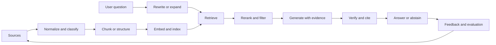

# RAG engineering: from documents to grounded answers

Retrieval-augmented generation is often described as “search plus a language model.” That is a useful first approximation and an inadequate production design. A robust RAG system is an evidence pipeline: it decides what to retrieve, how to represent it, how to rank it, how to expose it to a generator, and how to show uncertainty when the evidence is insufficient.

## Learning objectives

* Explain the difference between retrieval quality and answer quality.
* Design a corpus ingestion path with provenance and freshness.
* Compare dense, sparse, hybrid, graph, and corrective retrieval.
* Build an evaluation set that separates retrieval failures from generation failures.
* Identify security risks created by retrieved content.

## The complete path

Every arrow is a design choice. Ingestion determines whether the corpus is trustworthy. Chunking determines whether the retriever can find a complete fact. Query rewriting can improve recall while changing the user's intent. Reranking can improve precision while adding latency. Generation can synthesize evidence while also inventing unsupported connections.

## Corpus design

Start with a source contract. For each source, record the owner, canonical URL, publication or update date, access constraints, language, document type, and expected freshness. Preserve a stable source identifier through ingestion, chunking, indexing, retrieval, and citation. If a source cannot be traced back to its origin, it is difficult to debug or trust.

Chunking is not a universal number of tokens. It should respect the structure of the material. A standard may need section and clause boundaries. A runbook may need a procedure and its prerequisites. A table may need to stay intact. A long narrative may benefit from overlapping windows, but overlap can duplicate evidence and bias ranking.

A useful chunk record contains:

* Source identifier and canonical URL
* Heading path and document position
* Text and structural metadata
* Publication and ingestion timestamps
* Access or sensitivity classification
* Parent document and neighboring sections
* A checksum for change detection

## Retrieval choices

* **Sparse retrieval** is strong for exact names, error codes, identifiers, and terminology.
* **Dense retrieval** is strong for semantic similarity and paraphrase.
* **Hybrid retrieval** combines lexical and semantic signals and is often a safer default for enterprise corpora.
* **Reranking** uses a stronger model after an inexpensive first pass.
* **Graph retrieval** follows explicit relationships such as dependencies, ownership, topology, or chronology.
* **Agentic retrieval** allows the system to ask follow-up searches, but it increases latency and creates more opportunities for uncontrolled exploration.

A high retrieval score does not guarantee a useful answer. The retrieved passages may be relevant individually but insufficient together. Evaluation should therefore ask whether the evidence contains the answer, whether it is current, and whether the generated claims are supported by it.

## Worked example: procedure lookup

Imagine a user asks for the steps to rotate a credential. A weak RAG system retrieves a general security article and produces a plausible answer. A stronger system:

* Identifies the service and environment.
* Retrieves the current procedure and its prerequisites.
* Checks whether the user has permission to view the procedure.
* Separates read-only preparation from state-changing actions.
* Cites the exact procedure version.
* Refuses to invent a step when the source is incomplete.

The answer is better not because the model became more eloquent, but because the evidence path became explicit.

## Evaluation matrix

Evaluate at least four layers:

| Layer | Question | Example measurement |
| --- | --- | --- |
| Retrieval | Did the system find the relevant evidence? | Recall at k, MRR, nDCG |
| Context | Is the supplied context sufficient and non-duplicative? | Coverage, noise rate |
| Generation | Are claims supported and useful? | Groundedness, completeness, task success |
| Operations | Is the system usable and controlled? | Latency, cost, refusal quality, auditability |

A test set should include answerable questions, unanswerable questions, conflicting sources, stale sources, ambiguous terms, multilingual cases, and malicious instructions embedded in documents.

## Security reality

Retrieved text is data, not authority. A document can contain instructions intended to manipulate the model. Treat documents and tool results as untrusted input. Keep system policy outside the retrieved context, delimit evidence clearly, strip or neutralize executable markup where appropriate, and test whether an injected instruction can change tool selection or disclosure behavior.

RAG also creates access-control risks. Retrieval must be permission-aware, and authorization should be enforced before content enters the model context. Filtering the final answer is not an adequate substitute for preventing unauthorized retrieval.

## Trade-offs

* Larger chunks preserve context but reduce retrieval precision.
* More retrieved passages improve recall but consume context and increase distraction.
* Query expansion helps ambiguous questions but can drift from intent.
* Hybrid retrieval improves coverage but increases tuning complexity.
* Citation requirements improve accountability but can encourage superficial source matching unless claims are evaluated.
* Fresh indexing improves currency but can reduce reproducibility.

## Failure modes

* “Chunk, embed, and hope” without a corpus contract.
* Measuring only answer fluency.
* Returning citations that do not support the claim.
* Hiding uncertainty behind a confident summary.
* Mixing documents with incompatible dates or authority levels.
* Ignoring access control because the corpus is internal.
* Treating a vector database as a knowledge graph.

## Exercise: build an evidence ledger

Take 20 representative questions. For each, record the minimum evidence needed for a correct answer, the ideal source, whether the question should be answerable, and the correct abstention behavior. Run the questions through two retrieval strategies and compare evidence coverage before comparing generated text.

## Reference shelf

* **Research:** [Retrieval-Augmented Generation for Knowledge-Intensive NLP Tasks](https://arxiv.org/abs/2005.11401) — the foundational RAG paper.
* **Primary:** [NIST AI Risk Management Framework](https://www.nist.gov/itl/ai-risk-management-framework) — a risk-management lens for reliability, privacy, and accountability.
* **Implementation:** [Ragas documentation](https://docs.ragas.io/) — an open evaluation framework for RAG systems.
* **Implementation:** [LlamaIndex documentation](https://docs.llamaindex.ai/) — data connectors, indexing, retrieval, and evaluation patterns.
* **Implementation:** [Haystack documentation](https://docs.haystack.deepset.ai/) — modular pipelines for retrieval and generation.
* **Security:** [OWASP Top 10 for Large Language Model Applications](https://owasp.org/www-project-top-10-for-large-language-model-applications/) — threat categories relevant to RAG and agents.
* **Research collection:** [TREC](https://trec.nist.gov/) — information-retrieval evaluation tasks and methodology.

*Last checked: 2026-09-24.*
