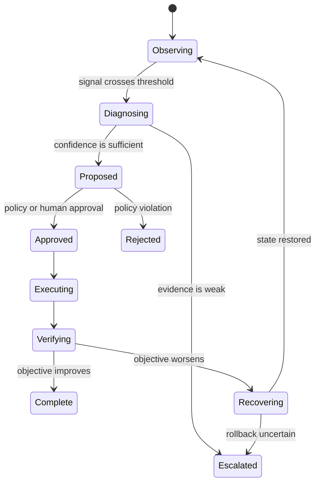

# Lab: design a guarded autonomous loop

This lab applies the same reasoning to telecom and IT operations. The objective is not to automate everything. It is to make one bounded loop explainable, measurable, reversible, and safe enough to evaluate.

## Choose a scenario

Examples include:

* Protecting a service objective during capacity pressure
* Detecting and triaging a repeated session-establishment failure
* Recommending a reversible configuration change
* Scaling a cloud-native network function under a defined policy

## Create the contract

Write down:

* Intent and scope
* Observed indicators
* Baseline and target
* Allowed action
* Forbidden action
* Required authority
* Verification window
* Rollback condition
* Escalation path

## Create the state machine

## Test the loop

Create at least five test cases:

* Normal operation
* False alarm
* Missing telemetry
* Action partially succeeds
* Post-change objective worsens

For each test, define the expected state transition and evidence. If the expected result is “the system asks for help,” make that a successful outcome rather than a failure.

## Deliverable

Submit a one-page architecture, the state machine, the test cases, and a paragraph explaining what the loop is deliberately not allowed to do.

## Further reading

* [ETSI ZSM](https://www.etsi.org/committee/zsm)
* [TM Forum Autonomous Networks](https://www.tmforum.org/oda/autonomous-networks/)
* [Google SRE books](https://sre.google/books/)
* [3GPP SA5](https://www.3gpp.org/DynaReport/TSG-WG--SA5.htm)
