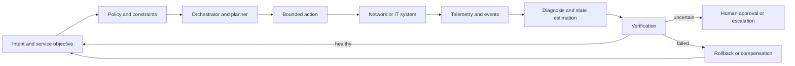

# Autonomous networks: from intent to verified control

Autonomous networking is not “put an agent in the network.” It is the disciplined conversion of intent into bounded actions, with telemetry, policy, assurance, and recovery. The same idea applies to telecom, cloud infrastructure, enterprise IT, and Packet Core operations, but the timing, safety, and evidence requirements differ by domain.

## Learning objectives

* Explain closed-loop automation and its control points.
* Distinguish intent, policy, configuration, and observed state.
* Map AI capabilities onto Packet Core and IT operations.
* Design guardrails for changes with different blast radii.
* Relate autonomy maturity to measurable outcomes.

## The closed loop

The loop is closed only when the system can observe the outcome of an action and determine whether the objective improved. Issuing a configuration change is automation. Verifying that the service objective improved is assurance.

## Intent is not a sentence

An intent should identify the desired outcome, scope, constraints, priority, validity period, and success measurement. “Improve user experience” is not executable. “Maintain session setup success above a target for a defined service population while respecting capacity and policy constraints” is closer, but still needs a mapping to observable indicators and allowed actions.

A useful intent contract contains:

* Subject and scope
* Desired state or objective
* Constraints and forbidden actions
* Priority and conflict resolution
* Time horizon
* Evidence required for acceptance
* Owner and approval authority
* Expiry and rollback behavior

## Packet Core mapping

A generic 5G Core or Packet Core control loop may observe registration, session establishment, mobility, policy, charging, user-plane, and slice indicators. The AI layer can help detect anomalies, correlate symptoms, propose hypotheses, or optimize bounded parameters. It should not be assumed to understand the network merely because it can summarize telemetry.

A safe pattern separates:

* **Observation:** read counters, traces, alarms, and configuration.
* **Interpretation:** form hypotheses and rank likely causes.
* **Planning:** propose a change with expected effect and risk.
* **Execution:** apply through an authorized orchestrator.
* **Assurance:** compare post-change state with the objective.
* **Recovery:** roll back or escalate when evidence disagrees.

## IT and SRE connection

Site reliability engineering contributes useful concepts: service-level objectives, error budgets, incident command, change management, and post-incident learning. AI can reduce toil, but it should not erase accountability. A system that automatically changes a service should produce an audit trail that an operator can understand after the fact.

## Autonomy levels

Maturity models are useful when they describe behavior rather than marketing labels. Consider a progression:

* **Advisory:** the system observes and explains.
* **Assisted:** the system proposes a change and an operator approves.
* **Guarded automation:** the system executes within a bounded policy envelope.
* **Coordinated autonomy:** multiple loops coordinate across domains.
* **Adaptive autonomy:** the system changes its strategy based on measured outcomes while preserving governance.

The level is not a permanent property of a platform. It depends on the use case, action class, evidence quality, and operating context.

## Worked example: capacity protection

Suppose a user-plane function approaches a capacity threshold. An autonomous loop may:

* Detect the trend and estimate confidence.
* Check whether the signal is caused by a measurement anomaly.
* Compare available capacity and placement constraints.
* Propose a scale-out or traffic-shift action.
* Apply the action through a controlled interface.
* Verify session success, latency, and error rates after a settling period.
* Roll back if the service objective worsens.

The AI component may help with diagnosis or prioritization. The authority to act comes from the policy and orchestration system.

## Failure modes

* Optimizing a local KPI while degrading the end-to-end service.
* Acting on delayed or incomplete telemetry.
* Confusing correlation with root cause.
* Cascading changes across multiple loops.
* No settling time before declaring success.
* A rollback that restores configuration but not user impact.
* An intent conflict with no priority or owner.

## Exercise: design a guarded loop

Choose one operational objective. Write the intent contract, list the telemetry required, define the smallest reversible action, set a verification window, and specify the escalation rule. Then list three ways the loop could be fooled and add a guard for each.

## Reference shelf

* **Primary:** [ETSI Zero-touch network and Service Management](https://www.etsi.org/committee/zsm) — standards work on zero-touch management and automation.
* **Primary:** [ETSI Experiential Networked Intelligence](https://www.etsi.org/committee/eni) — AI and cognitive network-management material.
* **Primary:** [3GPP specifications](https://www.3gpp.org/DynaReport/TSG-WG--SA5.htm) — management, orchestration, and charging specifications.
* **Primary:** [TM Forum Autonomous Networks](https://www.tmforum.org/oda/autonomous-networks/) — autonomy maturity, architecture, and industry guidance.
* **Primary:** [O-RAN Alliance specifications](https://www.o-ran.org/specifications) — open and intelligent RAN architecture references.
* **Practice:** [Google SRE books](https://sre.google/books/) — reliability, SLOs, and operational learning.
* **Implementation:** [Kubernetes documentation](https://kubernetes.io/docs/home/) — a practical reference for declarative infrastructure and controllers.

*Last checked: 2026-09-24.*
