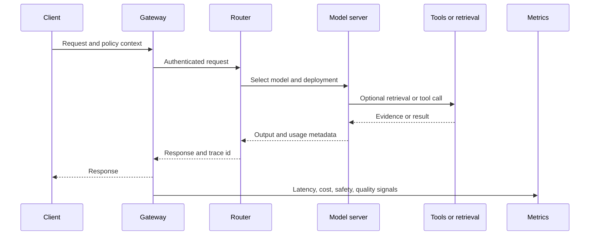

# Inference and serving: turning models into services

Training produces parameters. Serving turns those parameters into a behavior that users experience under real constraints. The serving system determines latency, throughput, cost, availability, privacy boundaries, and how quickly a team can change models without losing control.

## Learning objectives

* Decompose end-to-end inference latency.
* Explain the difference between throughput and responsiveness.
* Choose caching, batching, routing, and quantization strategies.
* Design a release path that supports rollback and comparison.
* Connect infrastructure metrics to user-visible quality.

## The request path

A model server is only one part of the path. Queueing, tokenization, retrieval, tool calls, network transport, safety checks, serialization, and client rendering can dominate the experience.

## Latency decomposition

For interactive systems, measure each component separately:

* Queue time
* Input processing or prefill time
* Time to first token or first result
* Decode or generation time
* Retrieval and tool time
* Post-processing and policy checks
* Network and client time

A single average hides tail behavior. Track percentiles and segment by model, route, input size, output size, and failure class.

## Throughput and batching

Batching improves hardware utilization by serving multiple requests together. Dynamic batching can improve throughput but may increase the waiting time for the first request in a batch. Continuous batching can keep a server busy while individual sequences finish at different times, but it adds scheduler complexity.

The correct objective depends on the product. A background summarization job may optimize cost per item. An interactive assistant may optimize time to first token and tail latency. An operations controller may optimize bounded completion time and predictable failure behavior.

## Routing

Routing can choose a model or deployment based on task, risk, language, context size, cost budget, or current load. A small model may handle classification and extraction, while a larger model handles ambiguous reasoning. Routing must be evaluated as part of the system because misclassification can create silent quality regressions.

A safe router should expose:

* The reason for the route when possible.
* A fallback policy.
* A maximum cost or latency budget.
* A way to sample decisions for review.
* A stable experiment identifier.

## Caching

Cache only when the validity conditions are clear. Candidate layers include tokenization, embeddings, retrieval results, tool results, and complete responses. Cache keys should include the model, prompt or policy version, relevant user scope, data freshness requirement, and any security boundary. A cache that ignores permissions is a data leak.

## Adaptation and compression

Quantization, distillation, pruning, speculative decoding, and compilation can reduce serving cost or latency. They can also change quality, calibration, or failure behavior. Treat every optimization as a candidate model version with a comparison set, not as a harmless infrastructure toggle.

## Worked example: two service tiers

A public documentation assistant and a control-plane planning assistant should not necessarily use the same route. The documentation assistant may tolerate streaming and eventual freshness. The planning assistant may need deterministic retrieval, stronger policy checks, a smaller action space, and a human approval boundary.

A two-tier design can share infrastructure while separating:

* Model and prompt policy
* Data sources
* Tool permissions
* SLOs and budgets
* Evaluation suites
* Incident response

## Release engineering

A release should identify the model, prompt, retrieval configuration, tool schemas, policy version, dependency lock, and evaluation results. Shadow traffic can compare a candidate without changing the user-visible result. Canary traffic limits exposure. Rollback must restore behavior, not just the container image.

## Failure modes

* Optimizing tokens per second while users wait on retrieval.
* Measuring mean latency while tail latency fails the SLO.
* Caching across authorization boundaries.
* Routing to a cheaper model without rechecking task quality.
* Updating a model without updating the evaluation set.
* Treating provider availability as application availability.
* Scaling the model server while the true bottleneck is a downstream tool.

## Exercise: define an SLO budget

Pick a user-facing AI task and assign a total latency budget. Divide it among gateway, retrieval, model, tools, safety checks, and network time. Then define a quality threshold and cost ceiling. Ask which component you would sacrifice first during overload and what evidence would justify that decision.

## Reference shelf

* **Implementation:** [vLLM documentation](https://docs.vllm.ai/) — high-throughput LLM serving and scheduling concepts.
* **Implementation:** [Hugging Face Text Generation Inference](https://huggingface.co/docs/text-generation-inference/index) — production serving patterns for generative models.
* **Research:** [FlashAttention](https://arxiv.org/abs/2205.14135) — efficient attention computation.
* **Research:** [Speculative Decoding](https://arxiv.org/abs/2211.17192) — accelerating generation with a draft model.
* **Primary:** [Kubernetes documentation](https://kubernetes.io/docs/home/) — orchestration primitives relevant to model-serving platforms.
* **Implementation:** [OpenTelemetry documentation](https://opentelemetry.io/docs/) — traces, metrics, and logs for service observability.
* **Research:** [Efficient Memory Management for Large Language Model Serving with PagedAttention](https://arxiv.org/abs/2309.06180) — serving memory and batching considerations.

*Last checked: 2026-09-24.*
