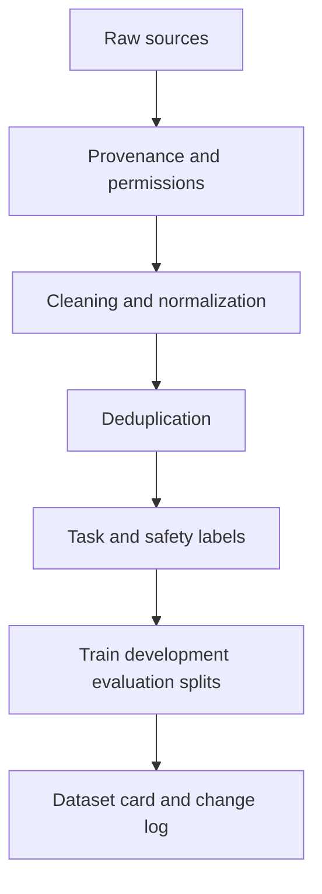

# Data and dataset quality

Data is not a neutral input. It determines which behaviors are rewarded, which failures are visible, and which users are represented in evaluation.

A useful production dataset usually has at least four layers:

* **Task data** that represents the work the system must perform.
* **Reference data** that defines acceptable answers or actions.
* **Safety data** that exposes misuse, ambiguity, and boundary conditions.
* **Operational data** that reveals latency, cost, retries, and user correction patterns.

## A data contract

A data contract makes assumptions explicit before training or evaluation begins.

| Field | Question |
|---|---|
| Purpose | What decision or behavior is this example meant to represent? |
| Provenance | Where did the example come from and may it be used? |
| Scope | Which users, languages, domains, and time periods are represented? |
| Label policy | What makes an answer correct, safe, or useful? |
| Split policy | How do we prevent leakage between development and evaluation? |
| Retention | When should the example be removed or refreshed? |

## Dataset quality is multidimensional

A large dataset can still be weak if it contains duplicates, contradictory labels, stale documents, or examples that do not resemble production traffic. Quality review should therefore check coverage, correctness, consistency, diversity, freshness, and leakage.

## Evaluation set design

Keep a protected evaluation set that is not continuously tuned against. Add a separate challenge set for rare, adversarial, multilingual, long-context, and out-of-distribution cases.

The [OpenAI evaluation guidance](https://developers.openai.com/api/docs/guides/evaluation-best-practices) emphasizes task-specific tests, automated scoring where possible, and human judgment where automated scores are incomplete. That combination is more realistic than treating one aggregate score as the definition of quality.

## Try this

Take one AI use case and write ten examples that would fail if the system relied on surface similarity rather than understanding. Those examples are often more valuable than another thousand ordinary examples.

## Thought experiment

If a team improves a dataset by removing every difficult example, has the model improved or has the test become easier?
