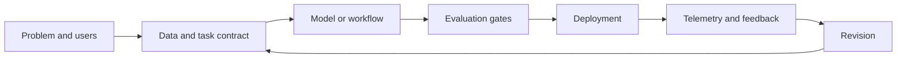

# Production AI engineering

A model is not a product. A production AI system is a coordinated set of data, models, prompts, retrieval, tools, policies, infrastructure, evaluations, and human decisions.

The interesting engineering question is not only whether a model can produce a good answer. It is whether the whole system can do so with acceptable quality, latency, cost, safety, and operational effort over time.

## The production loop

## Suggested path

* [Data and dataset quality](./data-and-datasets)
* [Model adaptation](./fine-tuning-and-adaptation)
* [LLMOps and release discipline](./llmops)
* [AI observability](./observability)
* [Quality cost and latency](./quality-cost-latency)

## The central tension

Every optimization changes the system boundary. A smaller model may reduce latency while increasing orchestration complexity. More retrieval may improve evidence coverage while increasing context cost. More autonomy may improve task completion while increasing the blast radius of mistakes.

## Think deeper

If an AI system improves its benchmark score but becomes harder to debug, is it actually a better system?

## Industry signal

The [Microsoft GenAIOps guidance](https://learn.microsoft.com/en-us/azure/architecture/ai-ml/guide/genaiops-for-mlops) frames generative AI operations as an extension of existing MLOps practice rather than a replacement for it. That framing is useful because it keeps versioning, deployment, monitoring, and governance in the same conversation.
