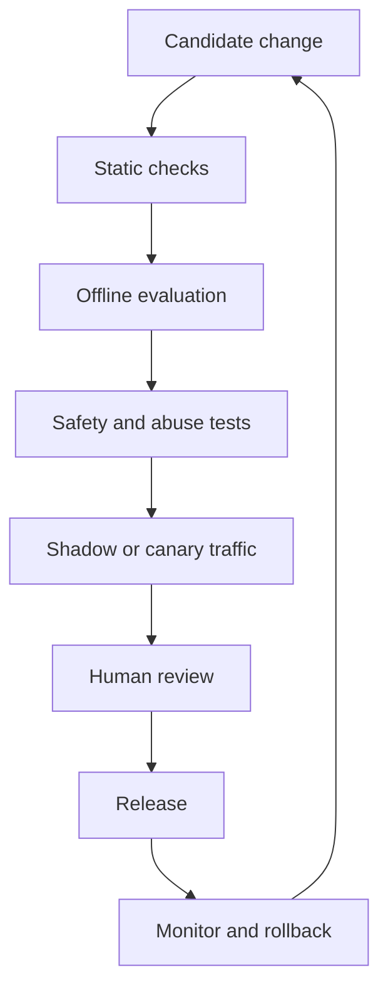

# LLMOps and release discipline

LLMOps is the operating discipline for systems whose behavior depends on models, prompts, retrieval indexes, tools, policies, and changing data.

A useful release record should identify every behavior-changing input:

| Component | Example versioned object |
|---|---|
| Model | Provider and model revision |
| Prompt | Template and instruction set |
| Retrieval | Index build and chunking strategy |
| Tools | Schema, permissions, and timeout policy |
| Evaluation | Dataset, rubric, and scorer version |
| Policy | Safety and access rules |
| Runtime | Serving configuration and dependency versions |

## Release gates

A release gate should be allowed to stop publication. Otherwise it is a report, not a gate.

## Reproducibility

Reproducibility does not mean that every generated token must be identical. It means that the team can reconstruct the important conditions of a result: inputs, model, prompt, tools, retrieval state, configuration, evaluator, and time.

The [Microsoft GenAIOps architecture guidance](https://learn.microsoft.com/en-us/azure/architecture/ai-ml/guide/genaiops-for-mlops) is useful here because it treats generative AI as an extension of lifecycle management. The operational question is: what changed, and can we explain the effect?

## Review lanes

* **Automatic lane** for low-risk changes with strong source and test coverage.
* **Canary lane** for changes that need live evidence before broad release.
* **Human review lane** for safety, policy, high-impact decisions, or ambiguous regressions.
* **Rollback lane** for known-good versions of every behavior-changing component.

## Thought experiment

If the model version is unchanged but the retrieval index changed overnight, did the system release a new behavior?
