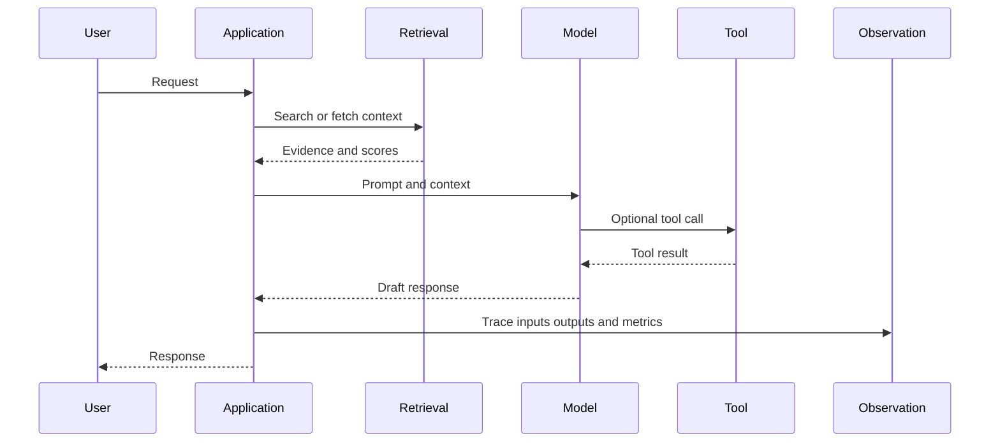

# AI observability

Traditional service monitoring asks whether a request succeeded. AI observability must also ask whether the result was useful, supported, safe, and produced within the intended budget.

## Trace the full request

## Useful signals

* Reliability: error rate, timeout rate, retry rate, and fallback rate.
* Performance: time to first token, total latency, throughput, and queue time.
* Quality: task success, groundedness, completeness, and user correction.
* Retrieval: hit rate, evidence coverage, stale-document rate, and citation support.
* Agent behavior: tool success, unnecessary steps, loops, and escalation rate.
* Economics: input tokens, output tokens, cache use, accelerator time, and cost per successful task.
* Safety: blocked requests, policy overrides, sensitive-data exposure, and confirmed incidents.

The [AWS generative AI observability guidance](https://aws.amazon.com/cloudwatch/features/generative-ai-observability/) emphasizes tracing prompt flows and monitoring usage, latency, and errors. The broader lesson is that a final answer without its path is difficult to debug.

## Privacy is part of observability

Logs can contain prompts, documents, identifiers, and model outputs. Decide what may be retained, what must be redacted, who may access it, and how long it remains available before enabling detailed tracing.

## Try this

Take one failed answer and reconstruct its path. Identify whether the failure began in the input, retrieval, prompt assembly, model response, tool result, post-processing, or user interface.

## Thought experiment

If your dashboard shows low latency and high availability but cannot tell whether answers are supported by evidence, is the AI system observable?
