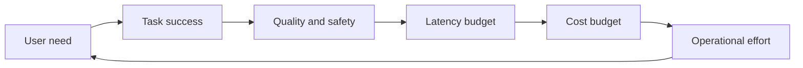

# Quality cost and latency

Production AI is a constrained optimization problem. A system that maximizes answer quality without a budget is not finished. A system that minimizes cost while failing the task is not efficient.

## A useful scorecard

| Dimension | Example question |
|---|---|
| Quality | Did the system complete the intended task? |
| Reliability | Does it behave acceptably across repeated and difficult cases? |
| Latency | Does it respond within the user and workflow budget? |
| Cost | What is the cost per request and per successful task? |
| Safety | Can failures create unacceptable harm or exposure? |
| Operability | Can the team detect, explain, and reverse bad behavior? |

## Optimize the system, not one component

Common levers include smaller models, routing, caching, batching, shorter context, better retrieval, structured outputs, early exits, and fallbacks. Every lever should be evaluated against task success rather than an isolated infrastructure metric.

## Cost per successful task

A cheap response that requires a human to redo the work may be more expensive than a slower response that completes it correctly. Track cost per successful task, not only cost per generated token or request.

## Industry signal

The [OpenAI evaluation guidance](https://developers.openai.com/api/docs/guides/evaluation-best-practices) recommends combining automated evaluation with human judgment. That principle matters for optimization because a cheaper system can look better numerically while becoming less useful to people.

## Try this

Create three configurations for one use case: a fast path, a balanced path, and a high-quality path. Compare them on the full scorecard and document the conditions that route a request to each path.

## Thought experiment

If a system is twice as accurate but four times as expensive, what additional value must it create before the change is justified?
