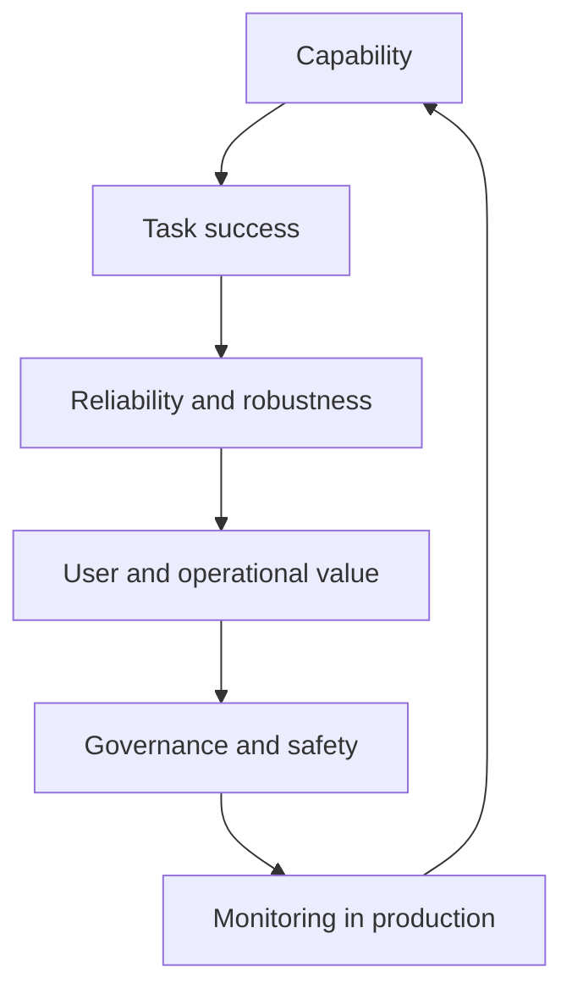

# AI system evaluation

## The opening puzzle

What does it mean for an AI system to be good?

A single benchmark score rarely answers the question. A production system must be useful for a task, reliable across realistic variation, efficient enough to operate, and safe within its permission boundary.

## The evaluation stack

## Evaluation layers

### Model evaluation

Tests the model's ability under controlled conditions: reasoning, generation, classification, perception, or prediction.

### System evaluation

Tests retrieval, tools, prompts, orchestration, memory, latency, and error handling around the model.

### Workflow evaluation

Tests whether the entire process solves the user's task, including human handoffs and downstream actions.

### Production evaluation

Tests drift, cost, user behavior, changing data, incidents, and long-term outcomes.

## Useful dimensions

* Correctness
* Factuality and citation quality
* Calibration and uncertainty
* Robustness to distribution shift
* Fairness and subgroup performance
* Latency and throughput
* Cost and energy
* Security and privacy
* Recoverability
* User value

## Benchmark traps

A benchmark can be useful and still misleading when:

* The test data leaks into training
* The benchmark does not resemble the real task
* The metric rewards style over substance
* The test set is too small or stale
* The system is optimized for the benchmark rather than the user

## Thought experiment

Would you prefer a system that is correct 90% of the time and confidently wrong 10% of the time, or one that is correct 80% of the time and reliably says “I do not know” when uncertain?

## Practical exercise

Create a small evaluation set with:

* Normal cases
* Ambiguous cases
* Adversarial cases
* Out-of-distribution cases
* Permission-boundary cases
* Cases where the correct response is to ask for clarification

Record both the output and the reason the output should be accepted or rejected.
