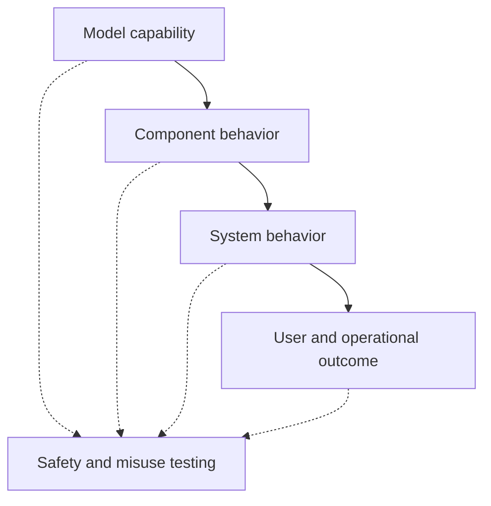

# Evaluation design: measuring what users actually need

Evaluation is not the final score on a leaderboard. It is the design of evidence that helps a team decide whether to ship, restrict, improve, or stop.

## Four layers of evaluation

A model can pass a capability test while the complete system fails because retrieval returns the wrong document, an agent uses the wrong tool, or the user cannot tell when the answer is uncertain.

## Build an evaluation matrix

| Dimension | Example question | Evidence |
|---|---|---|
| Task success | Did the answer or action solve the task? | Human or programmatic rubric |
| Grounding | Are important claims supported by available evidence? | Citation and entailment checks |
| Robustness | Does behavior survive paraphrase, noise, and missing context? | Perturbation sets |
| Safety | Does the system refuse or redirect risky requests? | Adversarial and policy tests |
| Operability | Can the team detect and recover from failure? | Traces, alerts, rollback drills |
| User value | Did the workflow improve the intended outcome? | Controlled or longitudinal study |

## Avoid the benchmark trap

Benchmarks are useful when they are relevant, stable, and difficult to game. They become misleading when:

* the benchmark is treated as the product requirement
* test data leaks into training or prompt design
* averages hide high-severity slices
* evaluators reward fluent style over correctness
* the system is evaluated without its retrieval, tools, and policies

## Design the failure set first

A powerful practice is to write the failure taxonomy before collecting the “happy path.” For a knowledge assistant, the set might include:

* correct answer with weak evidence
* wrong answer with persuasive evidence formatting
* stale source outranking a current source
* ambiguous question answered without clarification
* unauthorized information retrieved successfully
* tool action repeated after a timeout
* prompt injection inside a retrieved document

## Evaluation in production

Offline tests cannot represent every live interaction. Production evaluation should sample traces, protect sensitive data, compare versions, and connect model outputs to outcomes. It should also detect when the user’s behavior changes because the system changed.

## Research and industry references

* [HELM](https://crfm.stanford.edu/helm/latest/) is a framework for holistic language-model evaluation.
* [OpenAI Evals](https://github.com/openai/evals) provides an open-source framework for evaluating model behavior.
* [NIST AI Risk Management Framework](https://www.nist.gov/itl/ai-risk-management-framework) connects measurement to governance and risk management.

## Thought experiment

A model’s exact-match score improves, but users increasingly copy answers without checking sources. What new metric should be added to determine whether the system became safer or merely more persuasive?
