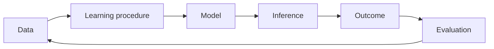

# AI foundations

## The opening puzzle

If a model can recognize patterns without being explicitly programmed with every rule, where does its apparent intelligence come from?

## A working definition

Artificial intelligence is the design of systems that perform tasks associated with perception, prediction, reasoning, generation, decision-making, or action in an environment.

The definition is intentionally functional. It describes what a system does without assuming that it thinks like a human.

## The core ingredients

* Data provides examples, observations, or feedback.
* A learning procedure adjusts parameters or policies.
* A model represents patterns, relationships, or strategies.
* Inference applies the model to a new input or situation.
* Evaluation checks whether the result is useful, correct, safe, or efficient.

## The first distinction: prediction versus action

A predictive model estimates what is likely. An acting system changes something in the world. The difference matters because action introduces consequences, feedback loops, permissions, and accountability.

A language model answering a question and an agent changing a production system may share a model, but they do not share the same risk profile.

## Engineering questions

* What is the task and what counts as success?
* What data represents the task fairly?
* What happens when the input is outside the training distribution?
* How expensive is inference?
* Can the result be checked before it causes harm?

## Thought experiment

Imagine two systems with identical model accuracy. One only recommends actions; the other executes them automatically. Which system is more intelligent, and which system requires more governance?

## Next steps

* Continue to [reinforcement learning](../learning/reinforcement-learning).
* Explore [RAG](../knowledge/rag) for knowledge-intensive systems.
* Compare [agents and agentic skills](../agents/agents-agentic-skills).
