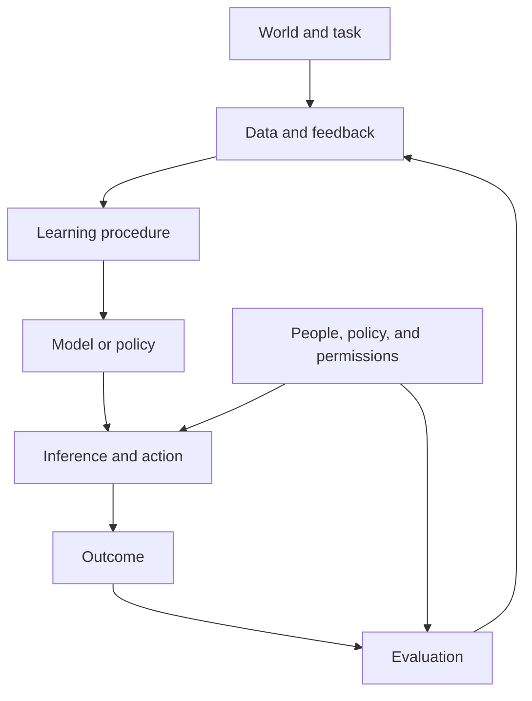

# AI foundations

## The opening puzzle

If a model can recognize patterns without being explicitly programmed with every rule, where does its apparent intelligence come from?

The short answer is that a model compresses regularities from examples into parameters or a policy. The longer answer is where the interesting engineering begins: what regularities were present, what was missed, what objective was optimized, and what happens when the system encounters a situation unlike its examples?

## A working definition

Artificial intelligence is the design of systems that perform tasks associated with perception, prediction, generation, reasoning, decision-making, or action in an environment.

The definition is intentionally functional. It describes what a system does without assuming that it thinks like a human.

## The intelligence stack



Modern AI systems are not just models. They are socio-technical systems composed of data, models, tools, interfaces, policies, operators, and feedback loops.

## Five questions for any AI system

### 1. What is the task?

Is the system predicting, generating, classifying, recommending, planning, or acting? A vague task produces vague evaluation.

### 2. What is the evidence?

What data, context, retrieval source, sensor input, or human feedback supports the output?

### 3. What is the objective?

The system optimizes a measurable objective. The objective may be a loss function, a reward, a preference signal, latency target, cost target, or business metric.

### 4. What is the boundary?

What is the system allowed to do? Which decisions require approval? What is reversible? What is the escalation path?

### 5. How do we know it worked?

Accuracy is only one dimension. Useful evaluation may include factuality, robustness, latency, cost, safety, calibration, fairness, recoverability, and user value.

## Prediction versus action

A predictive model estimates what is likely. An acting system changes something in the world. The difference introduces consequences, feedback loops, permissions, and accountability.

A language model answering a question and an agent changing a production system may share a model, but they do not share the same risk profile.

## A compact mathematical intuition

A supervised learner tries to find parameters that minimize error over examples:

```text
parameters → model(input) → prediction → error → parameter update
```

A reinforcement learner tries to improve long-term return:

```text
state → action → reward and next state → updated policy
```

A generative model learns a distribution over patterns:

```text
training examples → learned representation → new sample or completion
```

These are different lenses on learning. Many modern systems combine them.

## Engineering reality

The hardest part is often not selecting a model. It is specifying the task, collecting representative data, defining acceptable failure, instrumenting the system, and creating a feedback loop that improves rather than silently drifts.

## Thought experiment

Imagine two systems with identical model accuracy. One only recommends actions; the other executes them automatically. Which system is more intelligent, and which system requires more governance?

## Industry evidence prompts

When adding industry input to this chapter, look for:

* A research paper that changes how capability is measured
* An engineering report describing a production failure or optimization
* A standards or regulatory document defining acceptable system behavior
* An operator or enterprise case study that reports measurable outcomes

Do not use a product slogan as evidence of deployment success.

## Next steps

* Continue to [reinforcement learning](../learning/reinforcement-learning).
* Explore [RAG](../knowledge/rag) for knowledge-intensive systems.
* Compare [agents and agentic skills](../agents/agents-agentic-skills).
* Learn how to evaluate systems in [AI system evaluation](../evaluation/ai-system-evaluation).
