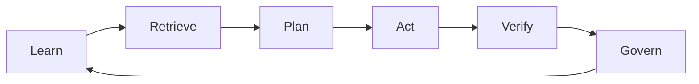

# Start here

Artificial intelligence is not one technology. It is a stack of ideas, learning paradigms, models, data systems, tools, infrastructure, institutions, and operating practices.

This tutorial is designed as a map through that stack.

## The promise and the puzzle

AI systems can retrieve information, generate content, make predictions, use tools, and coordinate actions. Yet capability is not the same as reliability, and automation is not the same as autonomy.

The recurring question is:

> What changes when intelligence becomes infrastructure?

## How to use this tutorial

* Start with the [AI atlas roadmap](./atlas/roadmap).
* Follow a concept from orientation to mechanics, engineering reality, and industry evidence.
* Use the diagrams to build a mental model before diving into implementation details.
* Treat the daily updates as a changing outer layer, not a replacement for the durable tutorial.
* Follow the thought experiments when you want to challenge an assumption rather than memorize a definition.

## Thought-provoking by design

Every major topic should contain at least one tension:

* Does retrieval improve truth, or only improve plausibility?
* Are agents autonomous systems or sophisticated workflows?
* Does reinforcement learning create intelligence, or optimize behavior inside a carefully designed world?
* Is network autonomy a technical property, an operating model, or both?

The goal is not to manufacture controversy. It is to make hidden assumptions visible.

## Evidence first

The living layer prioritizes public primary sources:

* Research papers and preprints
* Standards organizations
* Official technical documentation
* Operator and industry announcements
* Regulatory and policy publications
* Conference material and engineering reports

Every important claim should be traceable to a source. Quotes should be short, attributed, dated, and kept in context. Marketing claims should be labeled as claims rather than treated as proven outcomes.

## The atlas loop

The loop is deliberately broader than model training. Useful AI systems learn from data, retrieve context, plan actions, interact with tools or environments, verify outcomes, and operate within governance boundaries.

## What changes daily

The tutorial's stable chapters change slowly. The daily layer tracks:

* New research and benchmark results
* New model and infrastructure techniques
* Agent and skill patterns
* Standards and ecosystem developments
* Industry deployments and operating evidence
* Corrections, contradictions, and changing interpretations
