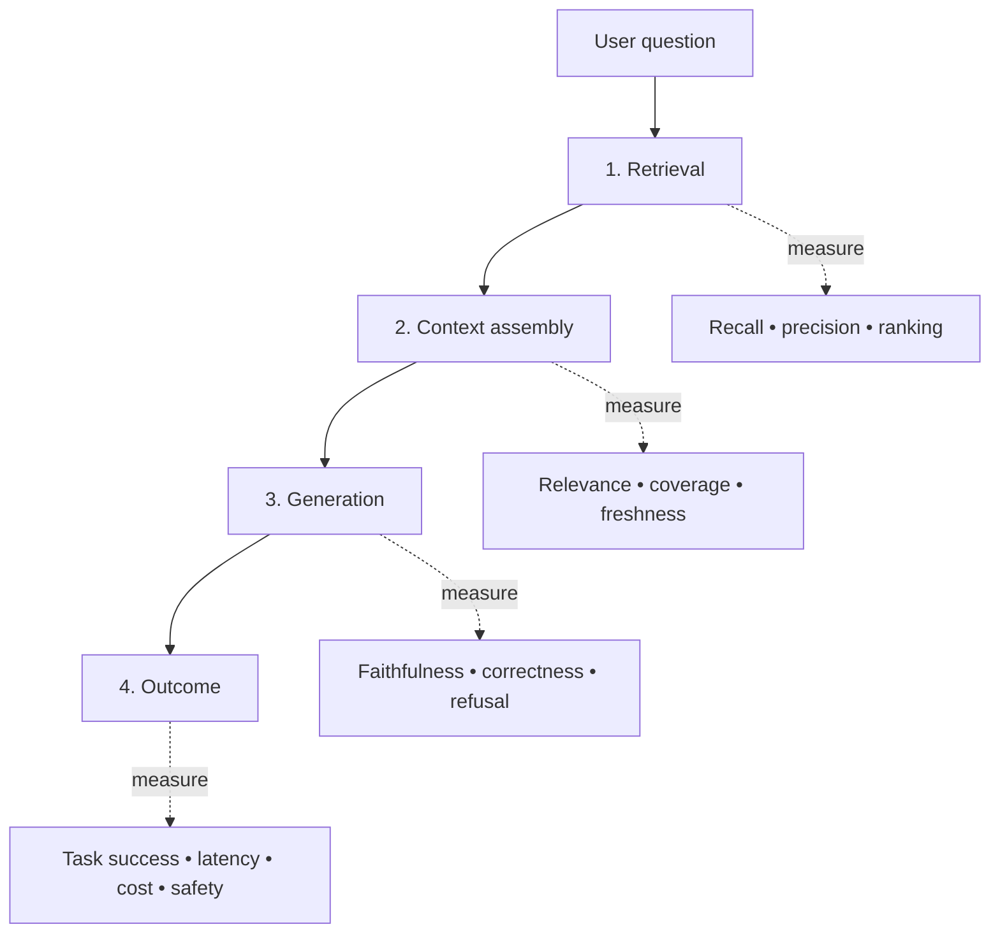

# RAG evaluation: measure the whole system

> If the answer sounds fluent, how do we know the system retrieved the right evidence?

RAG evaluation should separate the retrieval layer from the generation layer and then reconnect them at the end-to-end level. Recent survey work and industry guidance emphasize metrics such as context relevance, completeness, faithfulness, answer correctness, and business impact rather than relying on a single “quality” score ([ACL 2025](https://aclanthology.org/2025.acl-long.418/); [Google Cloud](https://cloud.google.com/blog/products/ai-machine-learning/optimizing-rag-retrieval)).

## The four-layer scorecard

### 1. Retrieval

Ask whether the right evidence was retrieved and ranked well enough to be useful. Useful measures include recall, precision, ranking quality, and the fraction of questions for which the corpus contains an answer.

### 2. Context assembly

A retriever can find relevant documents and still produce a poor prompt. Check chunk boundaries, duplication, ordering, metadata filters, freshness, and whether the assembled context actually covers the question.

### 3. Generation

Measure whether the answer is supported by the supplied context, answers the question, makes uncertainty visible, and refuses when the evidence is insufficient. Faithfulness is not the same as correctness: a response can be faithful to an incorrect or stale document.

### 4. Outcome

Connect technical scores to the task. Examples include successful resolution, time to answer, escalation rate, user correction rate, cost per task, and unsafe-output rate.

## Evaluation matrix

| Failure | Likely symptom | First diagnostic |
|---|---|---|
| Corpus gap | The system confidently says “not found” or invents an answer | Does the corpus contain a supporting passage? |
| Retrieval miss | The answer is weak despite good source material | Inspect top-k recall and query rewriting |
| Context overload | The right passage is present but ignored | Test ordering, compression, and context size |
| Grounding failure | The answer adds unsupported details | Compare each claim with retrieved evidence |
| Stale knowledge | The answer cites an old state | Test freshness metadata and update cadence |
| Objective mismatch | Scores improve but users do not | Compare offline metrics with task outcomes |

## A thought experiment

Suppose a RAG system improves answer faithfulness from 80% to 95%, but average latency doubles and users stop waiting for the answer. Did the system improve?

The answer depends on the task. Evaluation is a product decision as well as a model decision. A strong scorecard makes the trade-off explicit instead of hiding it inside a single benchmark number.

## Sources and further reading

- [RAG evaluation survey](https://arxiv.org/abs/2504.14891)
- [RAG retrieval optimization guidance](https://cloud.google.com/blog/products/ai-machine-learning/optimizing-rag-retrieval)
- [RAG evaluation research](https://arxiv.org/pdf/2508.14066)
