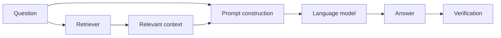
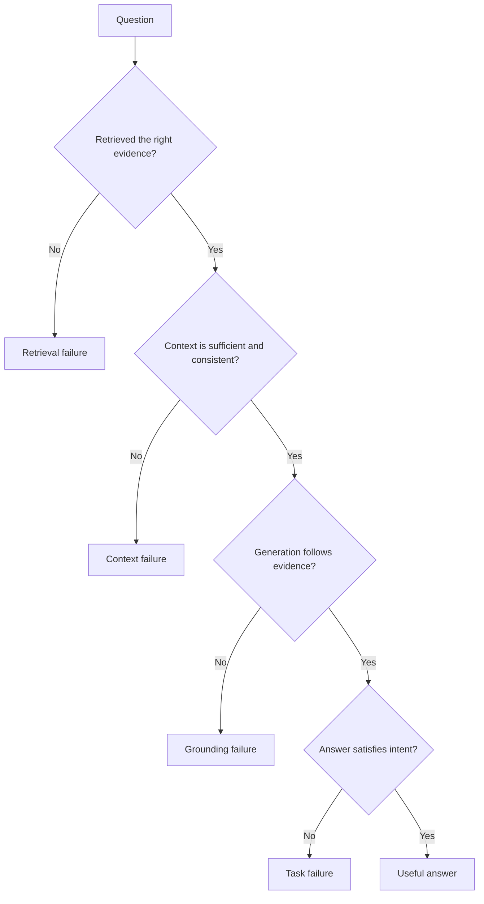

# Retrieval-augmented generation

## The opening puzzle

If a language model can retrieve evidence before answering, why can it still produce a confident error?

RAG combines retrieval with generation. The system searches an external knowledge source, places selected context into the model input, and asks the model to produce an answer grounded in that context.

RAG is not a single algorithm. It is a system design pattern.

## The basic architecture

## The RAG pipeline

### Ingestion

Documents are collected, normalized, permission-filtered, and enriched with metadata. Tables, images, and structured records may require different processing than prose.

### Chunking

Documents are split into retrievable units. Small chunks can improve precision but lose context. Large chunks preserve context but may dilute relevance and consume more context window.

### Representation

Text can be represented using lexical terms, embeddings, entities, graph relationships, or combinations of these.

### Retrieval

The retriever receives a query and returns candidate evidence. Common approaches include lexical search, vector search, hybrid search, metadata filtering, graph traversal, and query expansion.

### Reranking

A second model or scoring function can reorder candidates using a richer comparison between the question and retrieved passages.

### Context construction

The system selects, compresses, orders, and labels evidence before passing it to the language model.

### Generation and verification

The model produces an answer. A verification layer may check citations, entailment, numerical consistency, policy compliance, or answer completeness.

## Retrieval patterns

| Pattern | Strength | Typical weakness |
|---|---|---|
| Vector RAG | Good semantic matching | Can miss exact identifiers and dates |
| Lexical search | Strong for names and exact terms | Weak on paraphrase |
| Hybrid RAG | Combines semantic and exact matching | More tuning and infrastructure |
| Graph RAG | Makes relationships explicit | Requires maintained entities and edges |
| Multimodal RAG | Uses text, images, tables, and audio | Harder ingestion and evaluation |
| Agentic RAG | Can plan multiple searches | More latency, cost, and failure paths |
| Corrective RAG | Can detect weak retrieval and retry | Verification itself can fail |

## Failure taxonomy

* Retrieval failure: the needed evidence was not returned.
* Context failure: evidence was incomplete, contradictory, stale, or poorly ordered.
* Grounding failure: the model ignored or distorted available evidence.
* Task failure: the answer was supported but did not solve the user's actual problem.

## Evaluation dimensions

A good RAG evaluation separates retrieval from generation:

* Recall of relevant evidence
* Precision of retrieved evidence
* Reranking quality
* Citation correctness
* Claim entailment
* Completeness of the answer
* Robustness to ambiguous queries
* Freshness and access-control correctness
* Latency and cost

A system can score well on answer fluency while failing at retrieval or evidence attribution.

## Security and governance

RAG inherits the permissions and weaknesses of its knowledge sources. Important controls include:

* Document-level access filtering before retrieval
* Protection against prompt injection inside retrieved documents
* Source freshness and deletion handling
* Citation and provenance tracking
* PII and sensitive-data controls
* Audit logs for retrieval and tool use

## Practical experiment

Take one question and compare answers produced with:

1. No retrieval
2. Vector retrieval
3. Hybrid retrieval
4. Retrieval plus explicit evidence citations
5. Retrieval plus a verification step

Record correctness, confidence, traceability, latency, and cost. The best system is not necessarily the one with the longest answer.

## Thought experiments

* Does adding more retrieved context improve reliability, or can it increase ambiguity?
* If a retrieved document is authoritative but outdated, is the answer grounded?
* If the answer is correct but the cited passage does not support it, has the system succeeded?

## Industry evidence prompts

Look for evidence from technical case studies, engineering blogs, public evaluations, and research papers. Ask whether the source reports a deployment, a prototype, a benchmark, or only an intention.
