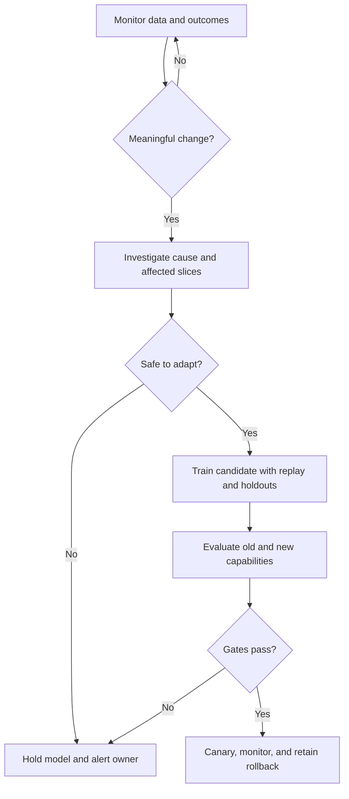

# Continual and federated learning

A model deployed into a changing environment eventually encounters new conditions. The question is not whether it will drift, but how the system will detect change, decide whether to adapt, and preserve capabilities that still matter.

## Continual learning

Continual learning updates a model as tasks, data, or environments evolve. The classic failure is catastrophic forgetting: learning a new distribution damages performance on an older one.

Useful design patterns include:

* Replay of representative historical examples
* Regularization that protects important parameters
* Separate adapters or experts for different regimes
* Task-aware routing
* Periodic consolidation into a new baseline
* Explicit rollback to a known-good model

The correct strategy depends on whether the environment changes gradually, abruptly, or cyclically. A model that adapts too quickly can chase noise; one that adapts too slowly becomes stale.

## Federated learning

Federated learning coordinates training across participants while keeping raw data local. A central service may aggregate updates, but privacy is not automatic. Updates can leak information, participants can be malicious, and non-identically distributed data can make the global model a poor fit for any one participant.

A federated design must specify:

* Participant eligibility and authentication
* Update clipping and secure aggregation
* Differential privacy or another privacy mechanism
* Handling of unreliable or straggling participants
* Personalization versus one global model
* Evaluation by participant and by data regime

Communication is a first-class constraint. The cost of sending updates, the number of rounds, and the reliability of the network can dominate the compute cost.

## Drift detection is not retraining

A drift detector can identify that a distribution or metric has changed. It does not establish why the change occurred or whether retraining will help. Pair drift signals with causal investigation, label-delay tracking, and a change-management process.

## A practical adaptation policy

## Exercise

Choose a model that may need adaptation. Define the drift signals, minimum evidence for retraining, protected historical slices, privacy requirements, canary plan, and rollback conditions. Explain which changes should never be automated without review.
