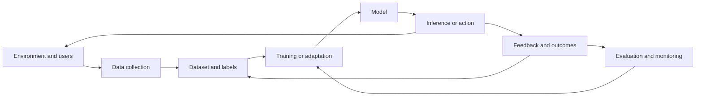

# Learning systems

A model is only one component of a learning system. The system also includes data collection, objectives, feedback, evaluation, deployment, monitoring, and the decisions made after a prediction. This distinction explains why a model that looks impressive in a notebook can disappoint in production.

## What you will learn

* How supervised, self-supervised, unsupervised, and reinforcement learning differ
* Why objectives and data distributions shape the behavior of a model
* How optimization turns an objective into parameter updates
* How deep networks learn representations and where generalization can fail
* How reinforcement learning formalizes sequential decisions
* When continual, federated, and active learning are useful
* How to design a learning system around evidence instead of benchmark scores alone

## The central question

A useful learning system is not simply one that minimizes a loss. It is one that improves a decision process under real constraints: incomplete data, changing conditions, limited latency, safety requirements, and imperfect feedback.

## A system view

The feedback arrow is where many real systems become difficult. Outcomes may arrive late, labels may be biased, and an intervention can change the data it later observes. A learning system therefore needs explicit assumptions about causality, feedback quality, and safe deployment.

## How to use this section

* **Orientation:** begin with learning paradigms and the learning-system design chapter.
* **Mechanics:** study optimization, representation learning, and reinforcement learning.
* **Engineering:** use the lab to design a training and evaluation plan.
* **Further reading:** use the reference shelf for canonical books, courses, papers, and maintained implementations.

## Thought experiment

Suppose a model improves a network-operations metric by taking actions that reduce the number of reported incidents. Is the system learning to improve reliability, or learning to make incidents less visible? What additional measurements would distinguish the two?
