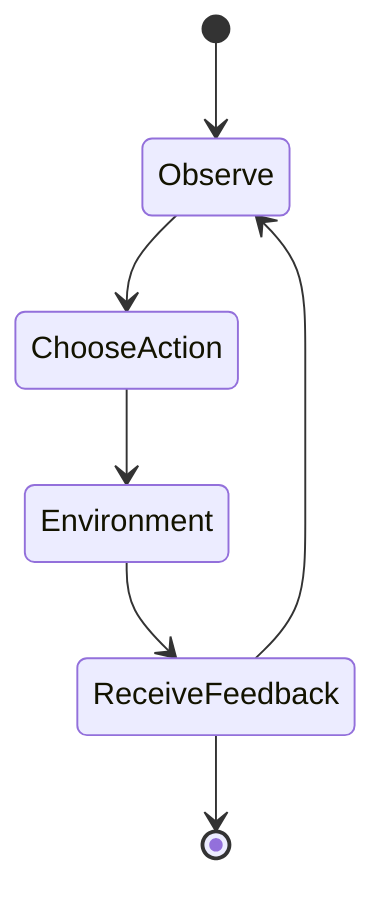

# Reinforcement learning deep dive

Reinforcement learning is a framework for choosing actions when decisions affect future states. It is not simply supervised learning with a different label. The label for an action depends on the trajectory that follows, and the agent may influence the data it receives.

## The core objects

* **State:** information used to summarize the relevant situation.
* **Action:** an intervention available to the agent.
* **Transition:** how the environment changes after an action.
* **Reward or cost:** a signal about the immediate outcome.
* **Policy:** a rule for choosing actions.
* **Value:** an estimate of long-term return under a policy.

A Markov assumption says that the current state contains enough information to predict the future. In practice, partial observability is common. The system may need a history, a belief state, or a recurrent memory to avoid making decisions from an incomplete snapshot.

## Reward design

A reward is a measurement of progress, not a full specification of intent. Problems appear when the reward is:

* Too narrow, so the agent finds a shortcut.
* Too delayed, so learning becomes noisy.
* Inconsistent across environments.
* Easy to manipulate through the agent’s own actions.
* In tension with safety, fairness, or operational constraints.

Use multiple outcome metrics and hard constraints where possible. A constraint such as “never exceed a defined error budget” is different from adding a small penalty to a reward. Penalties can be traded away; a constraint can be enforced by the action selector or a safety layer.

## Exploration and deployment

Exploration is valuable in simulation and dangerous in production. Separate the learning environment from the live environment through a simulator, a digital twin, a shadow policy, a constrained action set, or human approval for high-impact actions.

A safe progression is:

* Offline evaluation on logged trajectories
* Replay and counterfactual analysis where assumptions are explicit
* Shadow mode with no operational effect
* Bounded canary actions
* Gradual expansion with rollback conditions

Offline evaluation is difficult because the logged policy determined which actions were tried. An action that never occurred in the data cannot be evaluated without assumptions or a model of the environment.

## Credit assignment

When a delayed outcome arrives, the agent must estimate which earlier actions contributed. This is the credit-assignment problem. Longer horizons increase the opportunity for useful planning, but also increase variance, partial observability, and the chance that the reward is misattributed.

## Example: resource allocation

Suppose an agent assigns capacity across services. Immediate utilization may improve while tail latency, fairness, or resilience worsens. A useful design defines the state, action granularity, constraint set, reward horizon, fallback policy, and rollback trigger before training begins.

## Exercise

Design an RL problem for a system you know. Specify the state, action, transition, reward, constraints, baseline policy, simulator or offline dataset, and the evidence required before any live action is allowed. Then list two ways the agent could game the reward.
