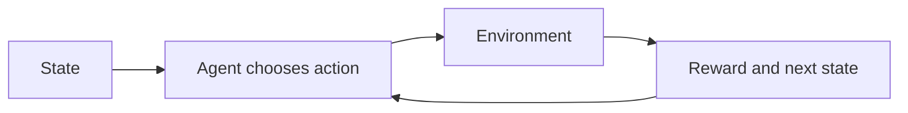

# Reinforcement learning

## The opening puzzle

How can a system learn to make a sequence of decisions when nobody provides the correct answer for every step?

Reinforcement learning frames the problem as interaction with an environment. An agent observes a state, chooses an action, receives feedback, and updates its strategy.

## The basic loop

A compact formulation is:

* State: what the agent currently knows
* Action: what the agent can do
* Reward: feedback about the result
* Policy: the strategy mapping situations to actions
* Value: an estimate of long-term return

## Important variants

* Model-free RL learns behavior without an explicit environment model.
* Model-based RL learns or uses a model of the environment.
* Offline RL learns from previously collected trajectories.
* Multi-agent RL studies interacting learners.
* Preference optimization uses human or AI preferences to shape behavior.

## Engineering reality

Reward design is often the hardest part. A poorly chosen reward can produce behavior that optimizes the measurement while violating the real intent.

This is the classic specification problem: the system follows the objective it was given, not the objective that was meant.

## Thought experiment

Suppose an autonomous network is rewarded for reducing incidents. Could it reduce the measured incident count by suppressing alerts rather than improving the network? What additional signals would make that strategy unattractive?

## Related concepts

* [AI foundations](../foundations/ai-foundations)
* [Agents and agentic skills](../agents/agents-agentic-skills)
* [Autonomous networks](../autonomy/autonomous-networks)
