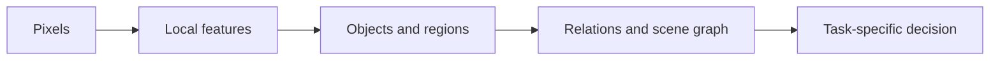

# Computer vision — from pixels to structured scenes

Computer vision is not one task. It spans recognition, localization, segmentation, tracking, reconstruction, generation, and action. The right question is not “Can the model see?” but “What visual representation does the downstream decision require?”

## A task map

- **Classification:** assign a label to an image or crop.
- **Detection:** identify objects and their locations.
- **Segmentation:** assign a class or instance identity to pixels.
- **Depth and geometry:** estimate distance, surfaces, and camera relationships.
- **Tracking:** maintain identity across frames.
- **OCR and document understanding:** recover text and layout.
- **Visual question answering:** combine image evidence with language.
- **Image retrieval:** find visually or semantically similar examples.

A classifier may be excellent for screening a known category and still be unsuitable for an open-world setting where unknown objects matter. A detector may find an object but fail to capture its state, orientation, or relation to another object.

## Representation hierarchy

Transformers made patch-based visual representations practical at scale, while convolutional networks remain important where locality, efficiency, or mature deployment tooling matters. The architecture choice should follow the data regime, latency budget, and required generalization—not fashion alone.

## Why segmentation changes the question

A bounding box says where an object approximately is. A mask can reveal its shape, overlap, damage region, or usable area. This enables more precise measurement, but it also creates more ways to be subtly wrong: a mask can look plausible while excluding the edge that matters to a downstream calculation.

The Segment Anything project is a useful reference for promptable segmentation. Its lesson is broader than the model itself: reusable perception primitives can reduce application-specific labeling work, but application quality still depends on prompts, domain shift, and evaluation data.

## Data and shift

Vision systems are sensitive to changes that are easy for people to overlook:

- Camera position, focal length, and firmware.
- Lighting, weather, glare, and occlusion.
- Device-specific compression artifacts.
- New object variants and changed operating procedures.
- Different annotation policies between teams.

A benchmark split by random images can overstate performance when adjacent frames, locations, or devices appear in both training and test sets. Better splits reflect deployment boundaries: time, geography, device, site, or operating condition.

## Evaluation beyond accuracy

Useful measures depend on the task:

- Detection: precision, recall, and intersection-over-union thresholds.
- Segmentation: region overlap and boundary quality.
- Tracking: identity continuity and recovery after occlusion.
- OCR: character or word error rate plus layout fidelity.
- Retrieval: recall at a useful candidate depth.
- VQA: answer correctness plus evidence localization.

Measure slices separately. A single average can hide a catastrophic failure on night scenes, small objects, or rare but important conditions.

## Practical pattern: visual evidence packet

For an application that uses images to support a decision, create an evidence packet containing:

1. Original asset identifier and timestamp.
2. Preprocessing and quality flags.
3. Model version and task output.
4. Confidence and uncertainty indicators.
5. Crops, masks, or regions supporting the result.
6. Human review outcome when required.

This makes visual inference inspectable and gives later evaluators something more useful than a final label.

## Exercise

Take a visual inspection task and define three annotation policies:

- What a novice annotator would mark.
- What an expert would mark.
- What a downstream decision actually needs.

Compare the policies. If they disagree, the problem may be specification design rather than model selection.

## References

- [Vision Transformer paper](https://arxiv.org/abs/2010.11929).
- [Segment Anything repository](https://github.com/facebookresearch/segment-anything).
- [COCO dataset and benchmark](https://cocodataset.org/).
- [Hugging Face vision tasks](https://huggingface.co/docs/transformers/tasks/image_classification).
