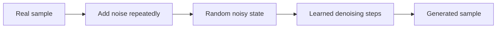

# Diffusion and generation — controlled synthesis from noise

Diffusion models learn to generate structured samples by learning a reverse process. During training, data is progressively corrupted with noise. The model learns to estimate how to move from a noisy state toward a clean sample. At generation time, a random starting point is denoised through a sequence of updates.

## The core intuition

The model does not store a database of finished images. It learns a distribution and a conditional transformation. The conditioning signal may be text, an image, a mask, a pose, an audio prompt, or another latent representation.

## Pixel space and latent space

Pixel-space diffusion is conceptually direct but expensive. Latent diffusion performs the process in a compressed representation and uses a decoder to return to the original space. This improves efficiency, but the encoder and decoder become part of the quality and failure surface.

The Latent Diffusion paper is a useful reference for understanding the trade-off between computational cost and perceptual quality. The Diffusers project provides practical implementations, schedulers, pipelines, and training examples.

## Controls are not guarantees

Text conditioning, negative prompts, masks, adapters, control networks, and reference images can steer generation. They do not guarantee exact object counts, spatial relationships, typography, identity preservation, or physical correctness.

A useful distinction is:

- **Semantic control:** the output is about the requested concept.
- **Structural control:** the layout, pose, geometry, or timing follows constraints.
- **Identity control:** a subject remains consistent.
- **Procedural control:** the system follows a repeatable production workflow.

A prompt may be strong on the first dimension and weak on the others.

## Sampling trade-offs

More denoising steps can improve quality for some models but increase latency. Guidance can improve prompt adherence but create artifacts or reduce diversity. Higher resolution can reveal detail while amplifying errors in anatomy, text, or edges.

Evaluate generation as a distribution, not one lucky sample. Record seed, model, scheduler, steps, guidance, conditioning inputs, and post-processing.

## Safety and provenance

Generated media creates questions about consent, identity, copyright, provenance, and disclosure. A responsible pipeline records whether an output is synthetic, which model produced it, what source assets influenced it, and what transformations were applied.

Watermarking or metadata can help, but neither replaces policy, audit logs, and user-visible disclosure.

## Exercise

Create a test matrix for an image generator with four axes:

- Prompt complexity.
- Structural constraints.
- Subject consistency.
- Resolution and latency budget.

For each cell, define a pass condition. Include a case where the correct system behavior is to refuse or request clarification rather than generate.

## References

- [Denoising Diffusion Probabilistic Models](https://arxiv.org/abs/2006.11239).
- [High-Resolution Image Synthesis with Latent Diffusion Models](https://arxiv.org/abs/2112.10752).
- [Hugging Face Diffusers documentation](https://huggingface.co/docs/diffusers/index).
- [Stable Diffusion repository](https://github.com/CompVis/stable-diffusion).
