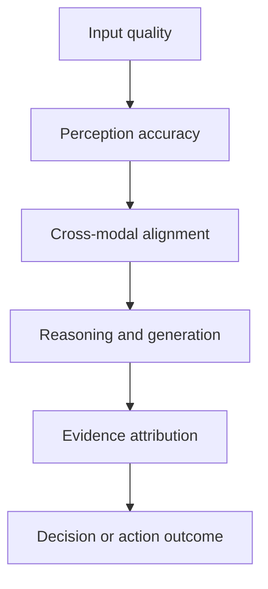

# Grounding and evaluation — connect outputs to evidence

Multimodal systems are often judged by how natural their outputs sound or look. That is not enough. A grounded system should connect an answer, label, image, or action to evidence that can be inspected and challenged.

## Four kinds of grounding

1. **Input grounding:** the output refers to content actually present in the input.
2. **Temporal grounding:** the claim points to the relevant time interval.
3. **Spatial grounding:** the claim points to a region, object, or relation.
4. **Operational grounding:** the proposed action respects tools, policies, and current state.

A response can be grounded in one sense and ungrounded in another. A caption can mention a real object but invent its intention. A transcript can contain real words but assign them to the wrong speaker.

## A multimodal evaluation stack

Evaluate each layer separately before measuring the final user outcome. Otherwise an impressive end metric can hide a brittle intermediate component.

## Build a slice matrix

A good evaluation set varies both the task and the environment:

| Dimension | Example slices |
| --- | --- |
| Modality quality | Blur, noise, missing audio, low light |
| Temporal structure | Short event, long event, overlapping events |
| Spatial structure | Small object, occlusion, crowded scene |
| Language | Jargon, accent, code switching, ambiguous reference |
| Domain shift | New device, site, camera, speaker, procedure |
| Consequence | Informational, assistive, safety-relevant |

Report both average performance and worst meaningful slice. A model that is excellent on clean images but unreliable on the deployment camera is not production-ready.

## Evidence-linked output contract

Require the system to return more than prose:

- Answer or prediction.
- Evidence references such as frame ranges, image regions, or audio intervals.
- Confidence or uncertainty statement.
- Missing-modality notice.
- Model and preprocessing version.
- Escalation recommendation when the evidence is insufficient.

The contract should make unsupported confidence difficult.

## Human evaluation with a rubric

Human review is useful when the rubric is concrete. Ask reviewers to score:

- Factual support.
- Completeness.
- Temporal or spatial precision.
- Harm if wrong.
- Helpfulness of uncertainty.
- Recovery after correction.

Do not ask only whether the result “looks good.” That question rewards fluency and presentation, not reliability.

## Thought experiment

Suppose a model identifies a fault in a video with 90 percent accuracy. The remaining 10 percent are concentrated in the most hazardous operating conditions. Would you deploy it? What additional evidence, routing, or human review would change the answer?

## References

- [NIST AI Risk Management Framework](https://www.nist.gov/itl/ai-risk-management-framework).
- [MMMU benchmark](https://arxiv.org/abs/2311.16502).
- [MMBench benchmark](https://arxiv.org/abs/2307.06281).
- [HEIM multimodal evaluation](https://arxiv.org/abs/2311.04287).
