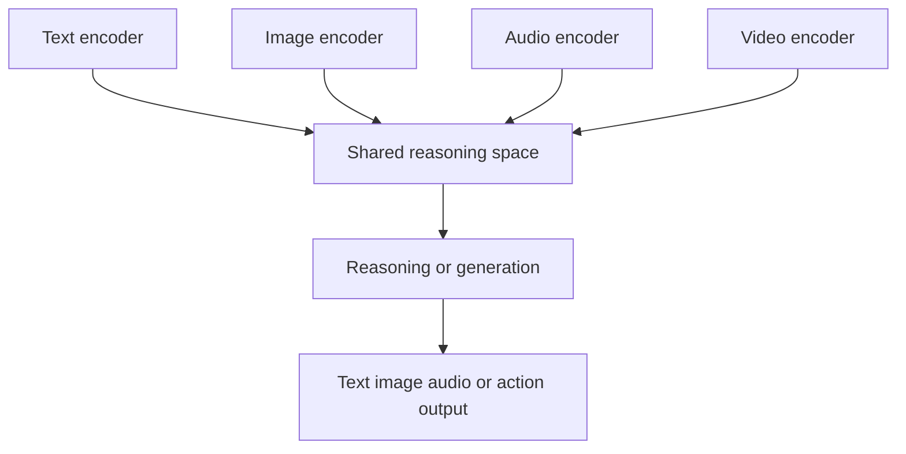

# Multimodal foundations — representations, alignment, and fusion

A modality is a structured way of observing or expressing information: text, pixels, waveforms, video frames, depth, telemetry, or actions. Multimodal AI does not simply put several inputs into a larger prompt. It must solve three problems:

1. **Representation:** how to convert each signal into useful computational units.
2. **Alignment:** how to associate units from different modalities.
3. **Fusion:** how to combine them without losing the structure that makes each modality informative.

## From raw signal to token-like unit

Text is commonly split into tokens. Images can be divided into patches or encoded into a latent grid. Audio may be represented as a waveform, a spectrogram, or learned acoustic units. Video adds a time axis, which makes motion and event boundaries important.

The unit is not neutral. A very small image patch preserves detail but increases sequence length. A compressed audio representation is efficient but may remove speaker or timing cues. A video tokenizer can capture motion, but it must choose how much temporal detail to retain.

## Three common architectures

### Early fusion

Inputs are converted into a shared sequence or tensor before the main model processes them. This can enable rich interactions, but the shared representation must accommodate very different statistics and sequence lengths.

### Late fusion

Each modality has a specialist encoder. Their outputs are combined near the reasoning or decision layer. This is easier to operate when modalities have different latency or availability, but cross-modal interactions may be weaker.

### Cross-attention or routed fusion

One stream attends to another, or a router selects specialists for a particular request. This provides a flexible middle ground and makes it possible to control cost, but routing and attention patterns become part of the system's reliability surface.

## Contrastive alignment

A contrastive objective can teach matching text and images to occupy nearby regions of an embedding space while mismatched pairs are pushed apart. This is powerful for retrieval and zero-shot classification, but proximity is not the same as explanation. An aligned embedding may support a useful search result without preserving the exact evidence needed for a high-stakes decision.

## Generative alignment

A generative model can learn to predict one modality from another or to continue a sequence that contains several modalities. This supports captioning, visual question answering, speech transcription, image generation, and interactive assistants. It also introduces a familiar failure mode: the model can produce a fluent answer even when the cross-modal evidence is weak.

## Availability is a design variable

Production systems should model missing modalities explicitly. A camera may be blocked, audio may be noisy, a document may contain an image without selectable text, or a sensor may arrive late. A robust system should know whether it is answering from all requested evidence or from a fallback path.

A useful request contract records:

- Modalities received and their timestamps.
- Resolution, sampling rate, or compression level.
- Preprocessing steps and detected quality problems.
- Which model or specialist handled each modality.
- Whether the final answer depends on an unavailable signal.

## Engineering trade-offs

| Choice | Advantage | Risk |
| --- | --- | --- |
| Shared representation | Simple downstream reasoning | Can erase modality-specific detail |
| Specialist encoders | Better domain fit | More components and calibration work |
| Large context window | Richer cross-modal evidence | Higher latency and cost |
| Aggressive compression | Efficient serving | Lost timing, spatial, or acoustic clues |
| Unified generation | Natural user experience | Harder attribution and evaluation |
| Routed specialists | Flexible cost and capability | Routing errors become user-visible |

## Exercise

Design two systems for answering questions about a maintenance video:

- A unified multimodal model.
- A pipeline with speech transcription, visual event detection, retrieval over procedures, and a text model.

For each design, specify what happens when the video has no speech, when the camera is obstructed, and when the procedure document conflicts with the observed action.

## Further reading

- [CLIP project and paper](https://openai.com/research/clip) — contrastive vision-language representation learning.
- [Vision Transformer](https://arxiv.org/abs/2010.11929) — patch-based image representation with transformer architecture.
- [Gemini technical report](https://arxiv.org/abs/2312.11805) — a reference point for general multimodal model design.
