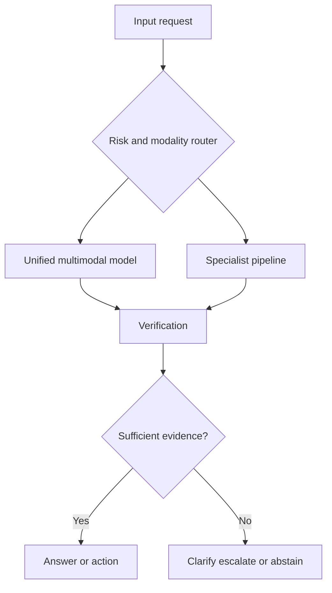

# Production patterns — build multimodal systems that remain operable

A prototype can pass a demo with one image, one microphone, or one short clip. A product must handle missing inputs, retries, model upgrades, cost limits, privacy requirements, and users who correct the system.

## Three architecture patterns

### Unified model

One model accepts several modalities and produces one or more outputs. This can simplify the user experience and enable rich interactions. It can also make attribution, routing, and debugging harder.

### Specialist pipeline

Each stage performs a focused task: OCR, detection, transcription, retrieval, reasoning, and response generation. This is easier to inspect and replace, but errors compound and orchestration becomes significant.

### Hybrid router

A router chooses a specialist or unified path based on input type, risk, latency, and confidence. This is often practical when not every request needs the most expensive model.

## Operational requirements

Track the following per request:

- Input modality inventory and quality.
- Model, adapter, prompt, and preprocessing versions.
- Latency by stage.
- Tokens, frames, seconds of audio, or other cost drivers.
- Evidence references.
- Abstentions, corrections, retries, and human escalations.
- User-visible output and policy decisions.

Without this record, teams cannot explain why a result changed after a model upgrade.

## Cost and latency

Multimodal cost is often driven by representation length rather than user-visible text. High-resolution images, long videos, repeated audio windows, and multi-pass verification can dominate the budget.

Useful controls include:

- Downsample or crop only when the task allows it.
- Use a cheap detector before a strong model.
- Cache stable embeddings and transcripts.
- Route low-risk requests to smaller models.
- Limit repeated context and redundant frames.
- Set explicit time and spend budgets.

## Privacy and retention

Images, voices, and video can contain identity, location, biometric, and workplace information. Define retention by data type and task. Separate raw media from derived features. Encrypt access paths and make deletion propagate to caches, embeddings, evaluations, and backups where required.

## Release strategy

Use shadow evaluation before changing the production path. Compare the candidate model on fixed slices and recent traffic samples, but do not treat traffic replay as sufficient: user behavior may change when the interface changes.

Release in stages:

1. Offline slice evaluation.
2. Shadow inference with no user-visible effect.
3. Small controlled cohort.
4. Monitoring and rollback window.
5. Wider rollout with continued slice checks.

## Exercise

Design a router for a multimodal support assistant. Inputs may be text-only, image plus text, audio plus text, or video. Define routing rules for low, medium, and high consequence requests. Include a case where the router deliberately asks for a better image instead of invoking a larger model.
