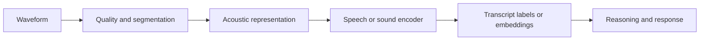
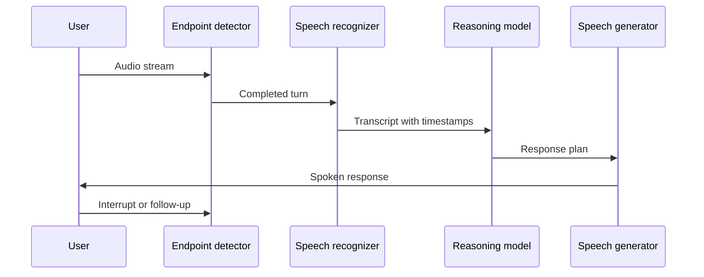

# Speech and audio — time, language, and uncertainty

Speech is simultaneously a signal, a sequence, a social interaction, and a source of language. Audio systems therefore need to reason about timing, overlapping speakers, accent variation, background sound, and the difference between what was said and what was intended.

## The audio pipeline

Common tasks include automatic speech recognition, translation, speaker diarization, keyword spotting, sound-event detection, emotion or paralinguistic analysis, text-to-speech, and music or general audio generation.

## Transcription is not the whole problem

A transcript can be accurate at the word level and still be operationally poor. It may lose speaker identity, timestamps, hesitations, code-switching, numbers, or domain terminology. For a meeting assistant, the useful object is often a time-aligned conversation record with speaker turns and confidence—not a paragraph of text.

Whisper is an influential open implementation and research reference for multilingual speech recognition. Its practical lesson is that scale and diverse data improve robustness, but domain-specific evaluation remains necessary for names, jargon, noisy channels, and rare languages.

## Time alignment matters

Audio events have boundaries. A system that detects “alarm” without its start and end time may be insufficient for incident analysis. A system that summarizes a conversation without linking claims to time ranges makes review slower and increases the risk of invented context.

Represent audio evidence as events:

- `speaker_id`
- `start_time`
- `end_time`
- `transcript_span`
- `event_type`
- `confidence`
- `quality_flags`

Keep this structure separate from the natural-language summary.

## Noise and distribution shift

Audio quality changes with microphones, codecs, room acoustics, network jitter, wind, simultaneous speech, and distance from the speaker. A model can appear reliable in clean benchmark audio and fail in the environment where it will actually operate.

Test by slices:

- Signal-to-noise ratio.
- Distance and microphone type.
- Accent and language.
- Overlap and interruption.
- Domain vocabulary.
- Short commands versus long-form speech.
- Human speech versus environmental audio.

## Generation and interaction

Text-to-speech systems must be evaluated for intelligibility, latency, prosody, speaker consistency, and inappropriate imitation. Real-time voice agents add turn-taking, interruption handling, endpointing, and recovery from partial recognition.

The interaction loop is often more important than the raw model:

## Exercise

Design an evaluation set for a voice assistant used in a noisy operations room. Include overlapping speech, alarms, abbreviations, numbers, silence, interruptions, and a user who corrects the system. Define which errors are tolerable, recoverable, or unsafe.

## References

- [Whisper repository](https://github.com/openai/whisper).
- [Whisper paper](https://arxiv.org/abs/2212.04356).
- [Hugging Face audio task guides](https://huggingface.co/docs/transformers/tasks/automatic-speech-recognition).
- [LibriSpeech benchmark](https://www.openslr.org/12).
