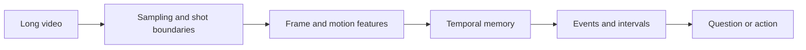

# Video and temporal models — understanding change over time

Video is not just a sequence of images. Meaning often lives in the relationship between frames: an object enters, a person reaches, a machine changes state, or an event unfolds over several minutes. A useful video system needs temporal sampling, memory, event boundaries, and a way to distinguish observation from prediction.

## The temporal compression problem

A long video contains far more frames than a model can process directly. The system must choose what to retain:

- Uniform samples are simple but can miss short events.
- Keyframe selection preserves visual changes but may lose context.
- Motion-aware sampling focuses on activity.
- Hierarchical summaries support long-range recall.
- Streaming memory avoids reprocessing the entire history.

Every strategy creates blind spots. A benchmark should test whether the sampling policy misses the events that matter.

## Understanding versus generation

Video understanding asks what happened, when, where, and who was involved. Video generation asks the system to create a temporally coherent sequence. The latter requires consistency of identity, geometry, lighting, camera movement, and physical interaction.

A clip can be visually impressive while violating continuity. A model may generate a plausible first and last frame but invent impossible intermediate motion. Evaluation therefore needs temporal criteria rather than only per-frame image quality.

## Event representation

Instead of storing only a summary, represent events as intervals:

- Start and end time.
- Entities and their identities.
- State change.
- Spatial relationship.
- Evidence frames.
- Confidence and uncertainty.

This supports retrieval and review. It also makes disagreement visible: two systems may agree that an event occurred while disagreeing about its start time or actor.

## Long-context designs

Long video can be handled by a single large context, a hierarchical memory, retrieval over clips, or an agent that requests additional windows. Each approach trades simplicity against cost and recall.

A practical design often uses a cascade:

1. Cheap detector identifies candidate intervals.
2. A stronger model analyzes selected windows.
3. Retrieval fetches procedures or prior events.
4. A language model produces an explanation tied to evidence.
5. A reviewer inspects the source interval for consequential decisions.

## Exercise

Take a 30-minute process recording and define an event ontology with no more than ten event types. Create a sampling policy and calculate what the system would miss if it sampled once every 30 seconds. Then design a targeted second pass.

## References

- [VideoBERT paper](https://arxiv.org/abs/1904.01766).
- [TimeSformer paper](https://arxiv.org/abs/2102.05095).
- [Kinetics dataset](https://deepmind.google/discover/blog/kinetics-dataset/).
- [Sora technical report](https://arxiv.org/abs/2402.17177).
