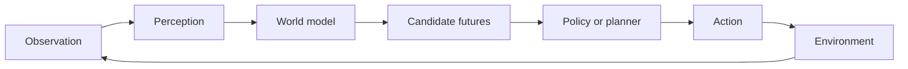

# World models and embodied AI — perception becomes action

A perception system describes what it sees. An embodied system must decide what to do next and deal with the consequences. World models are one approach to this problem: learn an internal predictive representation that lets an agent simulate possible futures before acting.

## The closed loop

The model does not need to reproduce every pixel. It needs to preserve the variables relevant to prediction and control: object state, affordances, dynamics, uncertainty, and the consequences of actions.

## Why simulation helps

Physical interaction is expensive, slow, and sometimes dangerous. A learned or engineered simulator can generate experience and allow an agent to compare policies offline. But simulation introduces a reality gap. A policy that works in a clean virtual environment may fail with sensor noise, friction changes, latency, unexpected obstacles, or a human behaving differently from the simulator.

## From demonstrations to skills

Embodied agents can learn from demonstrations, reinforcement learning, language instructions, or combinations of these. A reusable skill should specify:

- Preconditions.
- Perception requirements.
- Action policy.
- Termination condition.
- Recovery behavior.
- Safety limits.
- Evidence that the skill succeeded.

This connects embodied AI to the agentic-skills work in Sprint 7. A skill is not merely a prompt or a policy file. It is a governed capability with an interface and an evaluation story.

## Planning under uncertainty

A planner should distinguish three uncertainties:

- **State uncertainty:** the agent is unsure what the environment is like.
- **Model uncertainty:** the learned dynamics may be wrong.
- **Outcome uncertainty:** the same action may produce different results.

A safe controller can use observation checks, conservative actions, fallback policies, and human approval for irreversible steps.

## Reference platforms

The World Models paper provides a compact conceptual introduction. DreamerV3 demonstrates learning behavior in a latent world model across diverse environments. Habitat provides a simulator and research platform for embodied navigation. Open X-Embodiment is a useful reference for cross-robot data and generalization questions.

These references do not prove that general-purpose embodied intelligence is solved. They show how researchers make environments, datasets, policies, and evaluation concrete enough to compare.

## Exercise

Choose a simple household or industrial task. Write:

1. The observation space.
2. The latent state that matters.
3. The action space.
4. The success condition.
5. Three failure recoveries.
6. The simulator assumptions that could create a reality gap.

Then decide which parts should be learned and which should be enforced by rules.

## References

- [World Models](https://worldmodels.github.io/).
- [DreamerV3](https://danijar.com/project/dreamerv3/).
- [Habitat project](https://aihabitat.org/).
- [Open X-Embodiment](https://robotics-transformer-x.github.io/).
- [MuZero paper](https://arxiv.org/abs/1911.08265).
